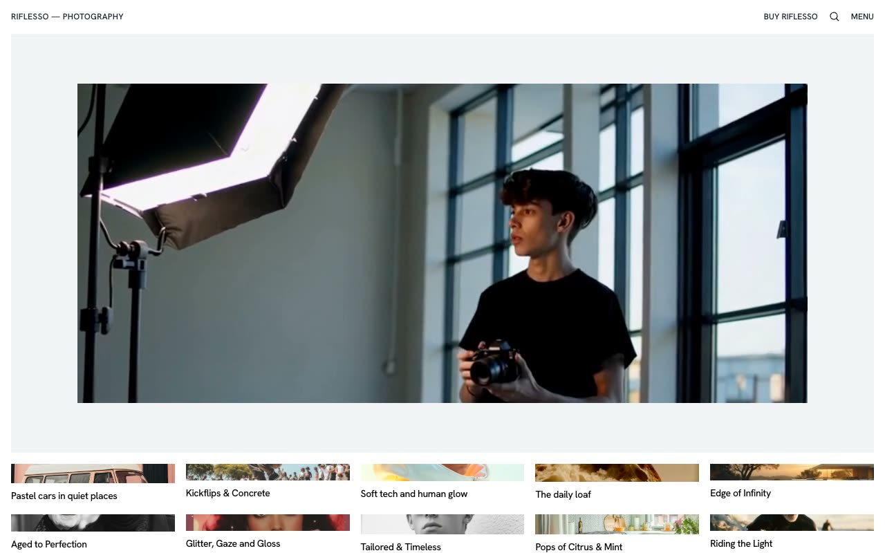

# Riflesso — Minimal Photography Portfolio Template Clone (Vanilla HTML + CSS + JS)

[](./demo.mp4)

Pixel-faithful clone of the Riflesso photography portfolio and magazine template by Lexington Themes, reproduced as self-contained plain HTML, CSS, and vanilla JavaScript with no build step required. The design is minimal and typography-driven — white background, Hanken Grotesk variable-weight font, sharp-cornered image cards, and a full-screen overlay navigation menu with staggered item animations. Six pages are included: a video hero homepage with responsive gallery grid, a magazine/blog listing, a blog post detail, a store product listing, a store product detail with HTML `details`/`summary` FAQ accordion, and a gallery post detail with sticky sidebar. A Fuse.js-powered search modal is built into every page. Generated with Claude Fable 5.

## Pages

| File | Description |
|---|---|
| `index.html` | Homepage — video hero + 10-item responsive gallery grid |
| `blog.html` | Magazine/blog listing — 10 posts in responsive grid |
| `blog-post.html` | Individual blog post detail with hero image and related posts |
| `store.html` | Store product listing — 6 products with prices |
| `store-product.html` | Product detail with specs grid and FAQ accordion |
| `gallery-post.html` | Gallery post detail with sticky sidebar |

## Run

No build step. Serve locally with Python's built-in HTTP server:

```sh
python3 -m http.server 8080
```

Then open `http://localhost:8080` in your browser.

Any static file server works — the only requirement is that files are served over HTTP (not opened directly as `file://`) so the video and font assets load correctly.

## Notes

- **Font:** Hanken Grotesk is loaded from Google Fonts as a variable font (weight 100–900, including italic). An internet connection is required on first load; subsequent loads use the browser cache.
- **Video hero:** `assets/video/photoshoot.mp4` is vendored locally — no external video CDN dependency.
- **Images:** All 36 gallery/blog/store images are vendored as WebP under `assets/images/`.
- **Search:** Fuse.js is loaded from a CDN script tag. The search modal on each page indexes the page's own content entries.
- **Navigation overlay:** The full-screen menu uses CSS transitions with per-item stagger delays (0.1 s each) controlled by inline `style` attributes set by JavaScript.
- **FAQ accordion:** `store-product.html` uses native HTML `<details>`/`<summary>` elements — no JavaScript required for the accordion itself.
- **Styles:** All pages share a single `styles.css`. The palette is white/near-black with OKLCH custom properties and an OKLCH purple/indigo accent scale.

`prompt.md` holds the full build specification. `demo.mp4` shows the template in motion.

## Credits

Faithful clone of an existing design, recreated for study/learning. All credit for the original design goes to its creators.

**Original:** Lexington Themes — https://lexingtonthemes.com/viewports/riflesso

---

Part of the [Templates](../../README.md) collection in the [claude-directory](../../../../README.md) — an open-source gallery of AI-generated UI built with Claude Fable 5. [Browse the live gallery](https://pulkitxm.com/claude-directory).
