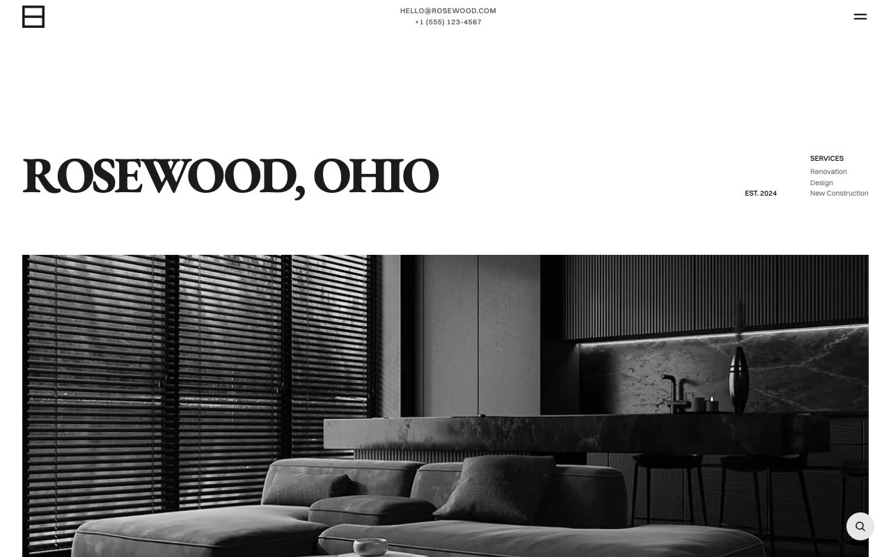

# Rosewood — Home Renovation & Construction Website Template Clone (Vanilla HTML/CSS/JS + Keen Slider + Fuse.js)

[](./demo.mp4)

Pixel-faithful same-to-same clone of the Rosewood premium template by Lexington Themes — a sophisticated, minimal home renovation and construction company website built in plain HTML, CSS, and vanilla JavaScript with zero build step required. The design features an elegant black-and-white neutral aesthetic using oklch color tokens, two premium typefaces (EB Garamond serif for display headings, Switzer sans-serif for body), a full-screen hamburger menu overlay, a Keen Slider services carousel, tabbed project showcase, before/after image comparison sliders, and a Fuse.js-powered search modal. All 23 pages are reproduced: home, services listing + 6 service detail pages, projects listing + 4 project case studies, about, process (6-step flow + guarantees), blog listing + 4 blog posts, contact, and free-quote form. Assets are fully vendored locally. Generated with Claude Fable 5.

## Run

No build step required. Open `index.html` in a browser, or serve the folder statically:

```sh
python3 -m http.server 8080
# then open http://localhost:8080
```

## Pages

| Page | File |
|------|------|
| Home | `index.html` |
| Services | `services.html` |
| Projects | `projects.html` |
| About | `about.html` |
| Process | `process.html` |
| Blog | `blog.html` |
| Contact | `contact.html` |
| Free Quote | `free-quote.html` |
| FAQs (404) | `faqs.html` |
| Service details | `services/{extensions,external-works,kitchens,bathrooms,loft-conversions,restorations}.html` |
| Project case studies | `projects/{bathroom-renovation,external-garden-path,loft-conversion,modern-kitchen-refit}.html` |
| Blog posts | `blog/posts/{1,2,3,5}.html` |

## Notes

- `styles.css` holds all shared design tokens and component styles as CSS custom properties; colors are driven through light/dark theme variables — dark mode is supported out-of-the-box via `prefers-color-scheme` with no hardcoded hex values in markup.
- The Keen Slider carousel is loaded from CDN (`cdn.jsdelivr.net/npm/keen-slider@6.8.6`).
- The search modal uses Fuse.js (`cdn.jsdelivr.net/npm/fuse.js@7.0.0`) for fuzzy search across all pages.
- Project case study pages use a drag-based before/after image comparison slider (no dependencies).
- `prompt.md` contains the full build specification. `demo.mp4` shows the template in motion.

## Credits

Faithful clone of an existing design, recreated for study/learning. All credit for the original design goes to its creators.

**Original:** Lexington Themes — <https://lexingtonthemes.com/viewports/rosewood>

---

Part of the [Premium templates](../) collection in the [claude-directory](../../../) — an open-source gallery of AI-generated UI built with Claude Fable 5. [Browse the live gallery](https://pulkitxm.com/claude-directory).
