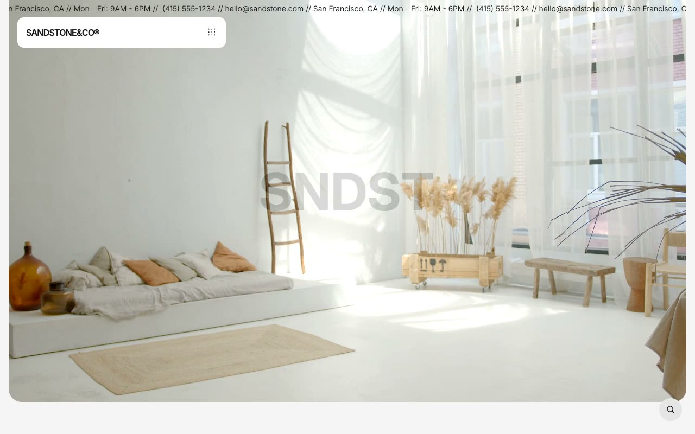

# Sandstone — Interior Design Studio Website Template Clone (Vanilla HTML/CSS/JS + Keen Slider)

[](./demo.mp4)

Pixel-faithful same-to-same clone of the Sandstone premium template by Lexington Themes — a sophisticated, minimalist interior design studio website built in plain HTML, CSS, and vanilla JavaScript with zero build step required. The design features an elegant grayscale aesthetic using oklch color tokens, Inter Variable font, a floating pill navigation with animated mobile menu, full-viewport video heroes, a CSS marquee ticker, Keen Slider testimonials and project carousels, stacked sticky process steps, and animated slide-up hover links throughout. All 13 pages are reproduced: home, projects listing + 4 project detail pages, services, studio/about, contact, blog listing + 3 blog posts, and system overview. Assets are fully vendored locally. Generated with Claude Fable 5.

## Run

No build step required. Open `index.html` in a browser, or serve the folder statically:

```sh
python3 -m http.server 8080
# then open http://localhost:8080
```

## Pages

| Page | File |
|------|------|
| Home | `index.html` |
| Projects | `projects/index.html` |
| Project detail 1 | `projects/1.html` |
| Project detail 2 | `projects/2.html` |
| Project detail 3 | `projects/3.html` |
| Project detail 4 | `projects/4.html` |
| Services | `services/index.html` |
| Studio | `studio.html` |
| Contact | `contact.html` |
| Blog | `blog/index.html` |
| Blog post 1 | `blog/posts/1.html` |
| Blog post 2 | `blog/posts/2.html` |
| Blog post 4 | `blog/posts/4.html` |
| System Overview | `system/overview.html` |

## Notes

- `assets/css/tokens.css` holds all shared design tokens as CSS custom properties; oklch grayscale palette drives every color — dark mode supported via `prefers-color-scheme` with no hardcoded hex values in markup.
- The Keen Slider carousel is loaded from CDN (`cdn.jsdelivr.net/npm/keen-slider@6.8.6`) for testimonials and project cards.
- The floating pill nav uses a height-animate mobile menu with `cubic-bezier(0.22,1,0.36,1)` easing.
- Hover links use a slide-up animation (translate Y 150%) matching the original's 0.5s ease-out transitions.
- The footer features an interactive services panel with background image switcher.
- `prompt.md` contains the full build specification. `demo.mp4` shows the template in motion.

## Credits

Faithful clone of an existing design, recreated for study/learning. All credit for the original design goes to its creators.

**Original:** Lexington Themes — <https://lexingtonthemes.com/viewports/sandstone>

---

Part of the [Premium templates](../) collection in the [claude-directory](../../../) — an open-source gallery of AI-generated UI built with Claude Fable 5. [Browse the live gallery](https://pulkitxm.com/claude-directory).
