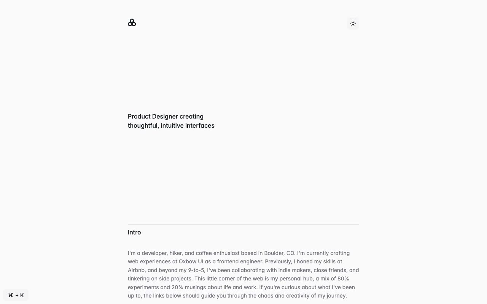

# Simplexity — Minimal Personal Portfolio & Blog Template Clone (Vanilla HTML/CSS/JS)

[](./demo.mp4)

Simplexity is a faithful clone of the Simplexity template by Lexington Themes — a minimal, content-focused personal portfolio and blog site built as self-contained plain HTML, CSS, and vanilla JavaScript (no build step, no framework). The design centers on a narrow column layout (max-width ~42 rem), the Inter Variable font, very subtle dividers, and a strong dark/light mode toggle. It targets developers and designers who want a clean, typographic personal site with blog, projects, and store sections. Generated with Claude Fable 5.

## Pages

| Page | File |
|------|------|
| Home | `index.html` |
| Blog listing | `blog/index.html` |
| Blog posts (10) | `blog/posts/1.html` … `blog/posts/10.html` |
| Store | `store/index.html` |
| Projects | `projects/index.html` |
| System Overview | `system/overview.html` |
| Pricing | `pricing.html` |
| About | `about.html` |
| 404 | `404.html` |

## Features

- **Dark/light mode toggle** — persisted to `localStorage`; respects `prefers-color-scheme` on first visit.
- **Cmd+K search modal** — fixed bottom-left search button, keyboard shortcut, live client-side filtering across posts, projects, and store items.
- **Narrow column layout** — `max-w-2xl` (42 rem) centered container with a `2xl:max-w-3xl` breakpoint.
- **Inter Variable font** — loaded from rsms.me/inter with alternate OpenType features (`cv02`, `cv03`, `cv04`, `cv11`).
- **Tag filter pills** on the blog listing page (3D, Design, Development, Growth, Guides, Illustration, Performance, UI/UX).
- **Vendored assets** — all images and icons are bundled under `assets/`; no external runtime dependencies beyond the Inter font CDN.
- No build step required — open `index.html` directly.

## Run

No build tools are needed. Open the project folder in a terminal and serve it statically:

```sh
python3 -m http.server
```

Then visit `http://localhost:8000` in your browser. Alternatively, open `index.html` directly in a browser (note: some browsers restrict `localStorage` on `file://` URLs, so the local server is preferred for testing the theme toggle).

The full build spec is in `prompt.md` and `demo.mp4` shows the template in motion.

## Credits

Faithful clone of an existing design, recreated for study/learning. All credit for the original design goes to its creators.

**Original:** Lexington Themes — <https://lexingtonthemes.com/viewports/simplexity>

---

Part of the [Templates](../) collection in the [claude-directory](../../../) — an open-source gallery of AI-generated UI built with Claude Fable 5. [Browse the live gallery](https://pulkitxm.com/claude-directory).
