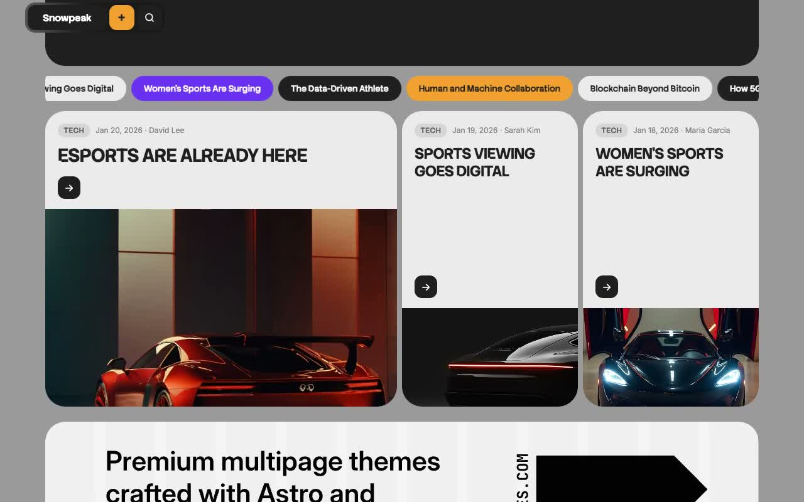

# Snowpeak — News & Media Publication Website Template Clone (Vanilla HTML/CSS/JS)

[](./demo.mp4)

Pixel-faithful reproduction of the Snowpeak template by Lexington Themes — a modern news and media publication website built as plain HTML, CSS, and vanilla JavaScript with no build step required. The design features a floating glassmorphism navigation pill, a large SVG wordmark hero block, an animated marquee ticker of article headlines, tabbed category-filtered article grids, a podcast listing page with interactive audio players, full-screen search modal, and authentication forms — all styled with a distinctive medium-gray base, near-black/near-white card contrast, and a purple/violet accent. The stack is self-contained HTML files with CSS custom properties (OKLCH color tokens), CSS Grid, Flexbox, Inter Variable font, and Stack Sans Notch display font. Generated with Claude Fable 5.

## Pages

| File | Description |
|---|---|
| `index.html` | Home page — hero logo, marquee ticker, featured grid, tabbed article sections, footer |
| `blog.html` | Blog listing — same hero, ticker, featured grid, all posts grid |
| `blog/post.html` | Article detail for "Esports Are Already Here" with full prose and sidebar |
| `blog/tag.html` | Tag-filtered view for the "Tech" category |
| `podcast.html` | Podcast listing with 10 episodes and interactive audio player controls |
| `sign-in.html` | Sign in form in a dark rounded card |
| `sign-up.html` | Sign up form with name field and orange submit button |

## Run

No build step is required. Open any page directly in a browser or serve the folder with a local static server:

```sh
# Option 1 — open directly
open index.html

# Option 2 — local static server (avoids any browser file:// restrictions)
python3 -m http.server 8080
# then visit http://localhost:8080
```

## Key features

- Fixed floating nav pill with glassmorphism `backdrop-filter: blur` effect
- Plus (+) toggle opens a dropdown menu with color-coded links
- Search button opens a full-screen modal with live headline filtering
- Animated marquee ticker (90 s loop, pauses on hover) with article headline pills
- Article cards with category tag, date, uppercase display-font title, author, and arrow button that morphs from rounded-xl to pill on hover
- Tabbed article sections: Top Stories | Business | Finance | Tech | Health | Sports
- Podcast player with simulated play/pause and seek controls
- Footer with 4-column grid: subscribe box, navigation, categories, social links
- Fully responsive using CSS Grid and Flexbox
- OKLCH design tokens for main background, card surfaces, accent, orange, and pink

`prompt.md` holds the full build specification. `demo.mp4` shows the template in motion.

## Credits

Faithful clone of an existing design, recreated for study/learning. All credit for the original design goes to its creators.

**Original:** Lexington Themes — https://lexingtonthemes.com/viewports/snowpeak

---

Part of the [Templates](../../) collection in the [claude-directory](../../../../) — an open-source gallery of AI-generated UI built with Claude Fable 5. [Browse the live gallery](https://pulkitxm.com/claude-directory).
