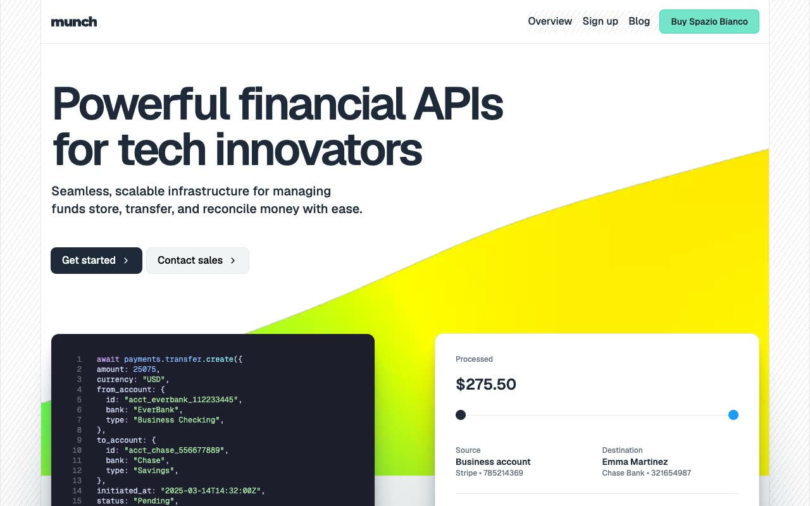

# Spazio Bianco — Fintech API Landing Page Template Clone (Vanilla HTML/CSS/JS + Tailwind CSS v4)

[](./demo.mp4)

Spazio Bianco is a pixel-faithful same-to-same clone of the Spazio Bianco fintech SaaS template by Lexington Themes — a clean, minimal multi-page website built for financial API platforms and modern banking infrastructure products. The design centers on a white-on-white aesthetic with a subtle 125° diagonal stripe background pattern, teal accents, yellow icon badges, and syntax-highlighted code blocks. All 11 pages are reproduced in plain HTML with Tailwind CSS v4 utility classes, Geist and Geist Mono fonts from Google Fonts, AOS scroll animations, marquee animations for brand logos and data streams, and vanilla JavaScript for the mobile menu, tab switcher, and Fuse.js-powered blog search modal. Generated with Claude Fable 5.

## Run

No build step required — all files are plain HTML/CSS/JS.

```sh
# Open directly in a browser
open index.html

# Or serve statically
python3 -m http.server 8000
# Then visit http://localhost:8000
```

## Pages

The clone reproduces all 11 discovered pages from the original:

- **Home** (`index.html`) — hero with code block + payment card demo, logo marquee, 8-item feature grid, API feature sections, transfer timeline, compliance section, tabbed code examples, customer case study card, pricing section
- **Blog** (`blog.html`) — hero with newsletter form, Fuse.js search modal, scrollable tag filter bar, 10-article card grid (3 cols)
- **Sign Up** (`sign-up.html`) — centered sign-up form with email input, terms checkbox, Google OAuth button, lime-stripe decorative sidebar
- **Contact** (`contact.html`) — split layout: contact details + live chat bubble (left), contact form (right)
- **Customers / Attentive** (`customers-1.html`) — customer case study with teal brand panel, headline quote, metrics, body copy
- **Customers / Exabeam** (`customers-2.html`) — second customer case study in same layout
- **System / Overview** (`system-overview.html`) — design system intro with component navigation
- **System / Colors** (`system-colors.html`) — full color palette swatches with oklch values
- **System / Links** (`system-links.html`) — link style specimens
- **System / Buttons** (`system-buttons.html`) — button variant showcase (primary, secondary, ghost)
- **System / Typography** (`system-typography.html`) — type scale and font specimen page

## Interactions

- **Mobile menu** — hamburger/close toggle reveals full-width animated nav panel (opacity + translate-y, 150ms)
- **Tab switcher** — tabbed code examples on home page; clicking a tab shows/hides corresponding code block and description
- **Blog search modal** — Fuse.js fuzzy search over article titles/descriptions; triggered by search icon button; `Esc` or overlay click to close
- **Chat bubble** — contact page floating chat widget toggles on click, closes on outside click
- **AOS scroll reveals** — fade-up / fade-down entrance animations (400–2500ms, ease easing)
- **Marquee animations** — quick (10s), normal (24s), and slow (48s) infinite horizontal scrolls for brand logos and terminal data streams
- **Hover effects** — icon badge bg transitions from yellow-400 to base-800 (300ms); card chevrons translate-x (300ms); card shadows elevate to shadow-2xl (500ms); nav links color to teal-600 (300ms)

## Notes

`prompt.md` contains the full build specification with design token documentation and page-by-page layout breakdown. `demo.mp4` shows the clone in motion.

Assets are vendored locally under `assets/images/`. CSS is vendored from the original Tailwind v4 compiled output under `assets/css/main.css`. AOS, Fuse.js, and Keen Slider are vendored under `assets/css/` and `assets/js/`. Geist and Geist Mono fonts are loaded from Google Fonts CDN (unavoidable — requires a network request).

## Credits

Faithful clone of an existing design, recreated for study/learning. All credit for the original design goes to its creators.

**Original:** Lexington Themes — <https://lexingtonthemes.com/viewports/spaziobianco>

---

Part of the [Lexington Themes](../) collection under [Premium Templates](../../) in the [claude-directory](../../../) — an open-source gallery of AI-generated UI built with Claude Fable 5. [Browse the live gallery](https://pulkitxm.com/claude-directory).
