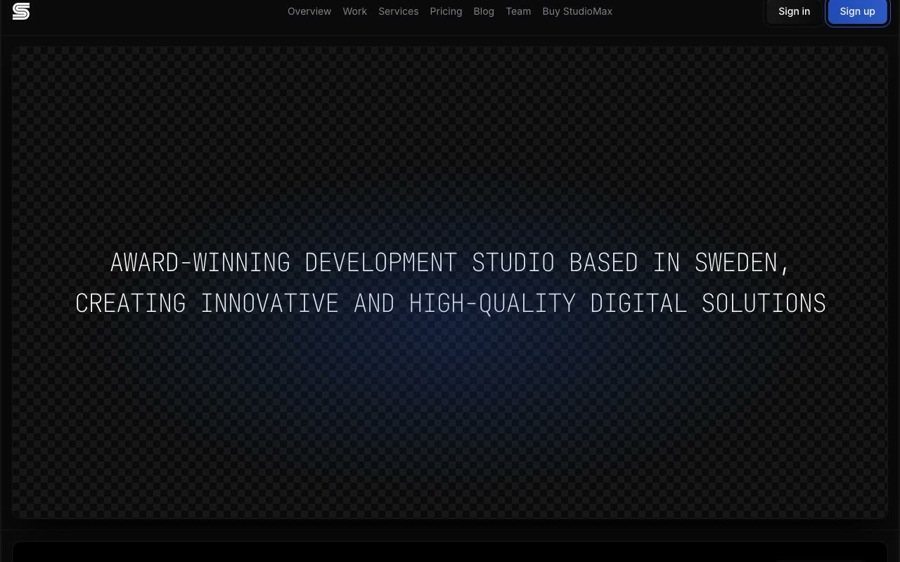

# StudioMax — Dark Design Agency Portfolio Website Template (Vanilla HTML/CSS/JS)

[](./demo.mp4)

StudioMax is an 11-page dark-themed design agency portfolio website template, pixel-faithfully cloned from the original by Lexington Themes. The design is built on a monochromatic black palette with fine border lines, geometric SVG background patterns (diagonal stripes and diamond/rhombus repeating grids), and a sharp typographic system pairing Inter (variable sans-serif) with JetBrains Mono for oversized hero headings. Pages cover the full agency content model: home, portfolio, blog, team, contact, authentication, project detail, blog post, service detail, and a design-system overview. No build step, no framework — plain HTML, a shared `styles.css`, and vanilla JavaScript. Generated with Claude Fable 5.

## Pages

| File | Page |
|---|---|
| `index.html` | Home |
| `work.html` | Work / Portfolio grid |
| `blog.html` | Blog / Journal |
| `team.html` | Team |
| `contact.html` | Contact |
| `sign-in.html` | Sign in |
| `sign-up.html` | Sign up |
| `work-detail.html` | Work detail (individual project) |
| `blog-post.html` | Blog post |
| `service-detail.html` | Service detail |
| `system-overview.html` | Design system / component overview |

## Run

No build step required. Open directly in a browser:

```sh
open index.html
```

Or serve locally to avoid any browser file-protocol restrictions:

```sh
python3 -m http.server
```

Then visit `http://localhost:8000`.

## Notes

- All assets are vendored locally under `assets/images/` — no external image requests at runtime.
- Fonts load from `rsms.me/inter` (Inter variable) and `api.fontshare.com` (JetBrains Mono).
- The shared `styles.css` drives the full design token system: palette (OKLCH values), type scale, spacing, `.bg-stripes` and `.bg-diamonds` SVG background patterns, and component variants.
- `prompt.md` holds the full build specification. `demo.mp4` shows the template in motion (with `poster.jpg` as the cover frame).

## Credits

Faithful clone of an existing design, recreated for study/learning. All credit for the original design goes to its creators.

**Original:** Lexington Themes — <https://lexingtonthemes.com/viewports/studiomax>

---

Part of the [Templates](../../README.md) collection in the [claude-directory](../../../../README.md) — an open-source gallery of AI-generated UI built with Claude Fable 5. [Browse the live gallery](https://pulkitxm.com/claude-directory).
