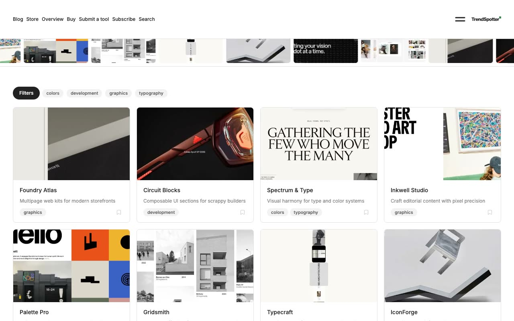

# Trendspotter — Design Tool Directory & Curation Website Template Clone (Vanilla HTML/CSS/JS)

[](./demo.mp4)

Pixel-faithful same-to-same clone of the Trendspotter premium template by Lexington Themes — a clean, minimal design tool directory and curation website built in plain HTML, CSS, and vanilla JavaScript with zero build step required. The design features a white background with a green oklch accent palette, Inter sans-serif typography, a horizontally scrolling marquee strip of tool screenshots, a searchable tool card grid with bookmark actions, tag-based filtering, animated modals (submit tool, subscribe newsletter), a Fuse.js-powered search overlay, and a consistent two-column nav with an SVG wordmark logo. All 13+ pages are reproduced: home tools directory, blog, store, store product detail, pricing, sign in, sign up, tool detail pages (10 tools), tag filter pages, submit tool form, system design overview, dashboard collections, and terms of service. Assets are fully vendored locally.

## Run

No build step required. Open `index.html` in a browser, or serve the folder statically:

```sh
python3 -m http.server 8080
# then open http://localhost:8080
```

## Pages

| Page | File |
|------|------|
| Home (tools directory) | `index.html` |
| Blog | `blog.html` |
| Store | `store.html` |
| Store product | `store/1.html`, `store/2.html` |
| Pricing | `pricing.html` |
| Sign in | `signin.html` |
| Sign up | `signup.html` |
| Tool details | `tools/tool/1.html` – `tools/tool/10.html` |
| Tag filter: colors | `tools/tags/colors.html` |
| Tag filter: development | `tools/tags/development.html` |
| Tag filter: graphics | `tools/tags/graphics.html` |
| Tag filter: typography | `tools/tags/typography.html` |
| Submit a tool | `tools/submit.html` |
| System overview | `system/overview.html` |
| Dashboard collections | `dashboard/collections.html` |
| Terms of Service | `infopages/terms.html` |
| Sign up form | `forms/signup.html` |

## Notes

- `styles.css` holds all shared design tokens and component styles as CSS custom properties; colors are driven through light/dark theme tokens — dark mode is supported via `prefers-color-scheme` with no hardcoded hex values in markup.
- The marquee strip uses a CSS `@keyframes` animation on a duplicated image set for seamless infinite scrolling; it pauses on hover.
- Modals (submit tool, subscribe) use CSS transitions (`opacity`, `translateY`) for smooth entrance/exit animations.
- The search overlay uses vanilla JS fuzzy matching across the tools dataset; no external library required.
- All navigation uses the original SVG wordmark logo extracted from the reference.
- `prompt.md` contains the full build specification. `demo.mp4` shows the template in motion.

## Credits

Faithful clone of an existing design, recreated for study/learning. All credit for the original design goes to its creators.

**Original:** Lexington Themes — <https://lexingtonthemes.com/viewports/trendspotter>

---

Part of the [Premium templates](../) collection in the [claude-directory](../../../) — an open-source gallery of AI-generated UI built with Claude Fable 5. [Browse the live gallery](https://pulkitxm.com/claude-directory).
