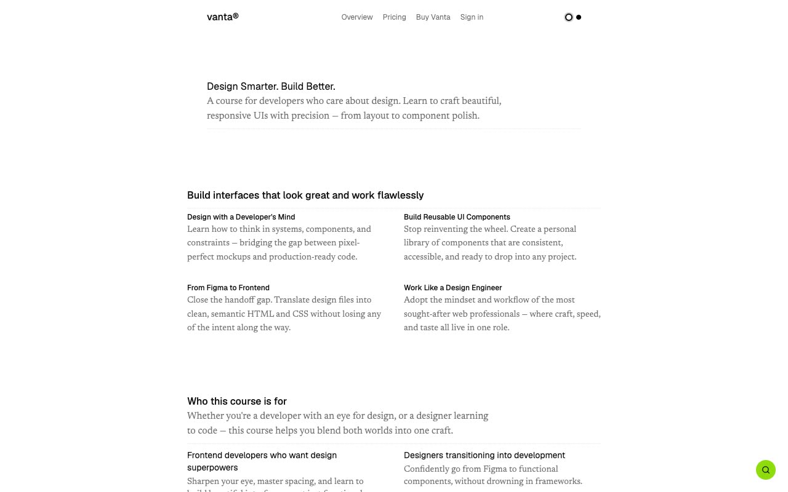

# Vanta — Online Course Platform Template Clone (Vanilla HTML + CSS + JS)

[](./demo.mp4)

Vanta is a pixel-faithful clone of the Lexington Themes "Vanta" online course platform template, rebuilt as a self-contained, no-build-step project in plain HTML, CSS, and vanilla JavaScript. The design is clean and minimal with a lime-green accent (`oklch(81.34% 0.218 130.43)`), an OKLCH-based light/dark color system driven by CSS custom properties, and a two-typeface pairing of Geist (sans) and Newsreader (serif) loaded from Google Fonts. Interactive features include a Keen Slider testimonials carousel, a Fuse.js site-wide fuzzy search modal, a monthly/annual pricing toggle, an FAQ accordion, and a scroll-triggered backdrop-blur fixed nav with localStorage-persisted theme switching.
## Pages

| File | Description |
|---|---|
| `index.html` | Home — hero, features grid, courses preview, testimonials carousel, blog posts |
| `courses.html` | Course listing with tag pills and two course cards |
| `pricing.html` | Monthly/annual pricing toggle, two plan cards, FAQ accordion |
| `sign-in.html` | Sign-in form with email/password and Google button |
| `system/overview.html` | System overview of static and content-collection sections |

## Run

No build step is required. Open any page directly in a browser or serve the folder with any static file server:

```sh
# Option A — Python (ships with macOS/Linux)
python3 -m http.server 8080
# then open http://localhost:8080

# Option B — Node.js npx
npx serve .
# then open the printed URL

# Option C — open directly
open index.html
```

All CDN assets (Keen Slider, Fuse.js, Google Fonts) are fetched at runtime; an internet connection is required.

## Notable techniques

- **OKLCH color system** — `--color-primary`, `--color-secondary`, and `--color-accent` are declared in `:root` and inverted under `[data-theme="dark"]`, giving a single-stylesheet light/dark theme.
- **Theme persistence** — the theme dot toggle writes to `localStorage` and respects `prefers-color-scheme` on first visit.
- **Keen Slider carousel** — the testimonials section wires up `keen-slider@6.8.6` (CDN) with previous/next buttons.
- **Fuse.js search modal** — a floating accent button opens a keyboard-dismissible modal backed by `fuse.js@7.0.0` (CDN) for fuzzy full-site search.
- **Pricing toggle** — a CSS animated slider switches between monthly and annual price values using `data-` attributes and vanilla JS.
- **Giant SVG wordmark footer** — an inline SVG "vanta" text with a mask-fade effect sits at the bottom of every page.
- **Vendored avatar images** — customer `webp` avatars are stored locally under `assets/` so the clone is fully self-contained without any external image dependencies.

## Reference

`prompt.md` contains the full build specification. `demo.mp4` shows the finished result in motion.

## Credits

Faithful clone of an existing design, recreated for study/learning. All credit for the original design goes to its creators.

**Original:** Lexington Themes — https://lexingtonthemes.com/viewports/vanta

---

Part of the [Templates](../) collection in the [claude-directory](../../) — an open-source gallery of AI-generated UI built with Claude Fable 5. [Browse the live gallery](https://pulkitxm.com/claude-directory).
