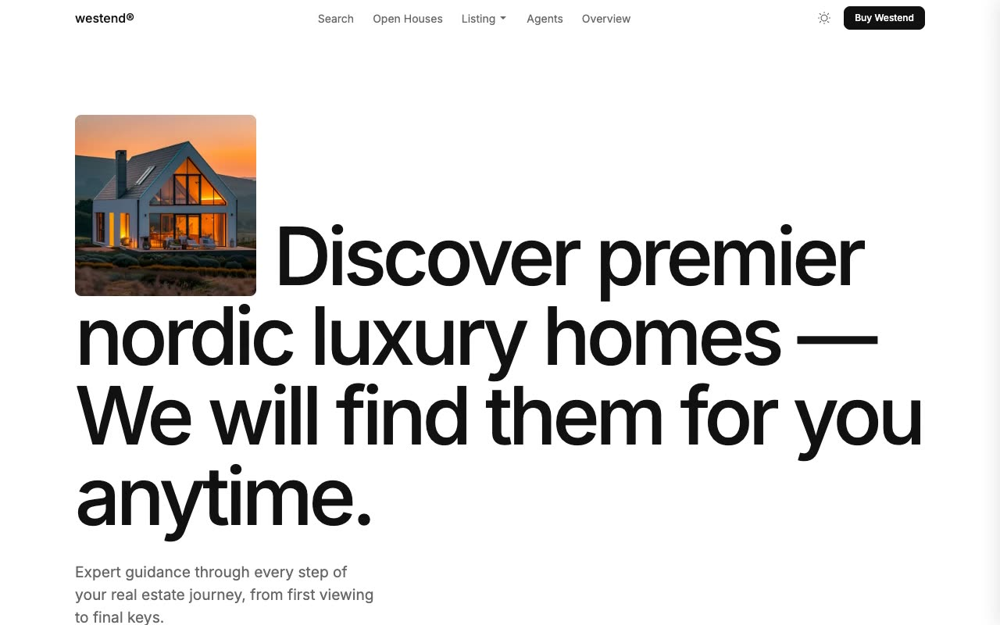

# Westend — Nordic Real Estate Website Template Clone (Vanilla HTML/CSS/JS)

[](./demo.mp4)

A pixel-faithful clone of the Westend premium real estate template by Lexington Themes — a multi-page Nordic property agency site featuring a dramatic typographic hero with inline property image, auto-scrolling Keen Slider property carousel, filter-tabbed listings, agent and neighborhood directories, open house listings, blog, FAQ accordion, contact and valuation forms, and a dark/light theme toggle. Built as a self-contained plain HTML, CSS, and vanilla JavaScript project with no build step required, using Inter Variable font, oklch-based design tokens, and all assets vendored locally. Generated with Claude Fable 5.

## Pages

The clone ships 26 pages covering the full template:

- **index.html** — Home (hero, slider, stats, property picks, open houses, why section, services, testimonial, blog, agents, footer)
- **properties.html** — All Properties (grid with hover overlays, filter tabs)
- **properties-for-sale.html / for-rent.html / off-market.html / sold.html** — Filtered listing views
- **agents.html** — Agents directory
- **agent-detail.html** — Individual agent profile with listings
- **neighborhoods.html** — Neighborhood directory
- **neighborhood-detail.html** — Individual neighborhood with stats and properties
- **open-houses.html** — Open house events list
- **open-house-detail.html** — Individual open house with RSVP form
- **services.html** — All services with category badges
- **blog.html** — Blog listing
- **blog-post.html** — Individual blog post with prose content
- **book-a-call.html** — Contact / consultation booking form
- **valuation.html** — Free property valuation request form
- **sell-your-property.html** — Sell your property form
- **company.html** — About / company page
- **resources.html** — Resources index
- **resources-faq.html** — FAQ with accordion
- **careers.html** — Job listings
- **system-overview.html** — Design system reference (typography, palette, components)
- **legal-privacy.html / legal-terms.html** — Legal pages
- **property-detail.html** — Individual property with gallery, features, agent contact

## Run

No build step required. Serve statically:

```sh
# Python
python3 -m http.server 8080

# Or open index.html directly in your browser
open index.html
```

## Key Features

- **Keen Slider** — Auto-playing, drag-scrollable property carousel on the home page
- **Dark / light theme** — CSS custom property tokens, `prefers-color-scheme`, localStorage persistence, no-flash boot script
- **Property card hovers** — Overlay with type / status / beds / baths / sqm slides up on hover
- **Nav dropdowns** — Fade-in + translate-y on hover/focus-within, mobile slide-in panel
- **Search modal** — Blur backdrop, live results across all pages and properties
- **Filter tabs** — Status-based filtering on properties pages
- **Accordion FAQ** — CSS grid-template-rows height animation

## Assets

All fonts loaded from Bunny Fonts CDN (Inter Variable). All property images, agent photos, and neighborhood images are vendored in `assets/images/` downloaded from the original template's preview site.

See `prompt.md` for the full build specification. `demo.mp4` shows the complete site in motion.

## Credits

Faithful clone of an existing design, recreated for study/learning. All credit for the original design goes to its creators.

**Original:** Lexington Themes — <https://lexingtonthemes.com/viewports/westend>

---

Part of the [Templates](../) collection in the [claude-directory](../../) — an open-source gallery of AI-generated UI built with Claude Fable 5. [Browse the live gallery](https://pulkitxm.com/claude-directory).
