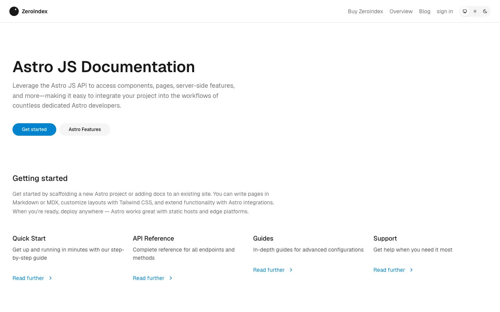

# ZeroIndex — Documentation & SaaS UI Template Clone (Vanilla HTML/CSS/JS)

[](./demo.mp4)

ZeroIndex is a faithful pixel-level clone of the Lexington Themes ZeroIndex template — a multi-page documentation and SaaS marketing site built entirely with vanilla HTML, CSS, and JavaScript (no framework, no build step). The template ships a marketing landing page, a sign-in page, a blog index, and a full documentation section covering getting-started guides, component references (accordion, alerts, badges, buttons, tabs, typography, wrappers), navigation pages, and an FAQ — all styled with a design-token CSS system, the Geist and Geist Mono typefaces, and a three-way light/dark/system theme toggle that persists to `localStorage`. Generated with Claude Fable 5.

## Pages

| Page | File |
|---|---|
| Marketing home | `index.html` |
| Sign in | `sign-in.html` |
| Blog | `blog/index.html` |
| Introduction | `docs/getting-started/introduction.html` |
| Quick start | `docs/getting-started/quick-start.html` |
| Accordion | `docs/components/accordion.html` |
| Alerts | `docs/components/alerts.html` |
| Badges | `docs/components/badges.html` |
| Buttons | `docs/components/buttons.html` |
| Tabs | `docs/components/tabs.html` |
| Typography | `docs/components/typography.html` |
| Wrappers | `docs/components/wrappers.html` |
| FAQ | `docs/help/faq.html` |
| Sidebar / Sidebar links | `docs/navigation/sidebar.html`, `docs/navigation/sidebar-links.html` |

## Run

This is a plain HTML/CSS/JS project — no build step required.

**Option 1 — open directly in a browser:**

```sh
open index.html
```

**Option 2 — serve with Python (recommended, avoids path issues):**

```sh
cd "/path/to/zeroindex"
python3 -m http.server 8080
# then open http://localhost:8080
```

All assets (`assets/tokens.css`, `assets/layout.css`, `assets/main.js`) and inter-page links use relative paths, so any static file server works.

## Notable details

- `assets/tokens.css` — full design-token layer: OKLCH color scales (neutral, sky-blue accent, orange, emerald), Geist/Geist Mono font variables, and semantic mappings for light and dark themes.
- `assets/layout.css` — layout and component styles built on top of the tokens.
- `assets/main.js` — vanilla JS initialising theme toggle, mobile sidebar, accordions, active-link highlighting, search, tabs, copy buttons, table-of-contents, and feedback widgets.
- `prompt.md` holds the full build specification; `demo.mp4` shows the template in motion.

## Credits

Faithful clone of an existing design, recreated for study/learning. All credit for the original design goes to its creators.

**Original:** Lexington Themes — <https://lexingtonthemes.com/viewports/zeroindex>

---

Part of the [Templates](../) collection in the [claude-directory](../../../../) — an open-source gallery of AI-generated UI built with Claude Fable 5. [Browse the live gallery](https://pulkitxm.com/claude-directory).
