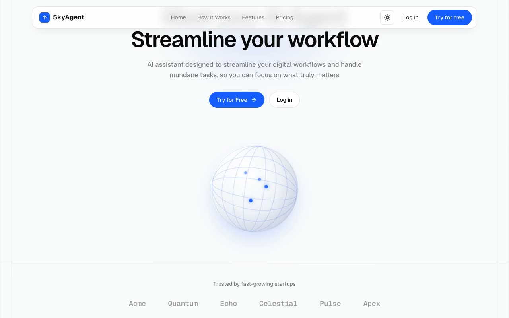

# SkyAgent — AI Agent SaaS Landing Page Template Clone (Vanilla HTML/CSS/JS)

[](./demo.mp4)

A self-contained, pixel-faithful clone of the SkyAgent AI-agent startup landing page from the Magic UI template gallery, built as a single-page marketing site with a sticky pill navbar, a centered hero with an animated globe, a bento feature grid, a monthly/yearly pricing table, a vertical marquee testimonial wall, an FAQ accordion, and a full-width CTA banner. It ships a persisted light/dark theme toggle, scroll entrance reveals, a "how it works" step accordion, and a Geist Sans/Mono type scale on OKLCH color tokens — all in plain HTML, CSS, and vanilla JavaScript with no build step and assets vendored locally. Generated with Claude Fable 5.

## Run

No build step. Serve the folder with any static server, for example:

```sh
python3 -m http.server
```

Then open the printed local URL (e.g. `http://localhost:8000/`). Opening `index.html` directly also works.

## Notes

- **Theme toggle** — `app.js` toggles a `dark` class on `<html>` and persists the choice in `localStorage` under the key `skyagent-theme`; light/dark tokens are defined in OKLCH in `styles.css`.
- **Animated globe** — the hero globe is rendered as pure CSS (no external runtime), making it robust in both headless and real browsers.
- **Interactions** — sticky navbar shadow on scroll, mobile hamburger menu, single-open "how it works" and FAQ accordions, monthly/yearly pricing switch, and `IntersectionObserver`-driven scroll reveals are all in `app.js`.
- **Content** — the testimonial wall and FAQ list are generated in `app.js` and split into a three-column vertical marquee; avatars live in `./assets/avatars/`.

See `prompt.md` for the full build spec and `demo.mp4` for the page in motion.

## Credits

Faithful clone of an existing design, recreated for study/learning. All credit for the original design goes to its creators.

**Original:** Magic UI (Agent template) — <https://agent-magicui.vercel.app/>

---

Part of the [Templates](../../README.md) collection in the [claude-directory](../../../../README.md) — an open-source gallery of AI-generated UI built with Claude Fable 5. [Browse the live gallery](https://pulkitxm.com/claude-directory).
