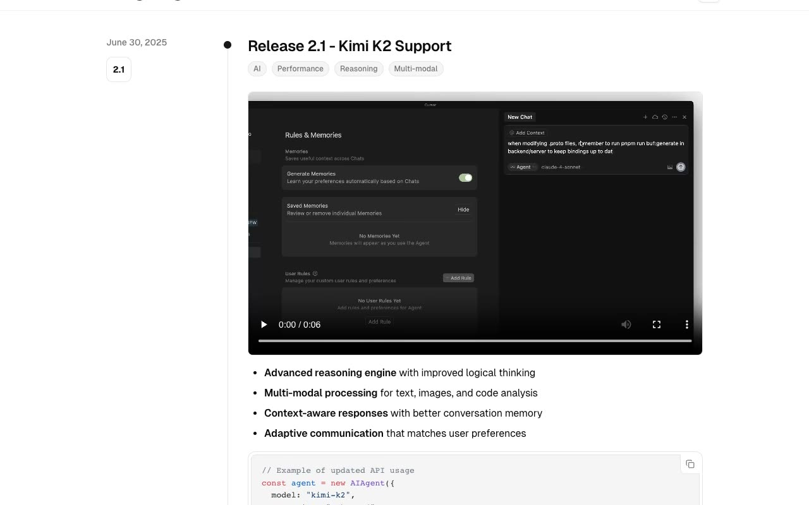

# Changelog — Release Notes Timeline Template Clone (Vanilla HTML/CSS/JS)

[](./demo.mp4)

A self-contained, no-build clone of the Magic UI "Changelog" template: a minimal, editorial release-notes page built on the shadcn/ui design language. It features a vertical timeline of release entries — each with a date and version badge, category pills, media, feature bullets, a syntax-highlighted code block, and collapsible "Features" / "Bug Fixes" accordions — plus a light/dark theme toggle that is system-aware and persisted to `localStorage`. Built with plain HTML, CSS (OKLCH design tokens, vendored GeistSans), and vanilla JavaScript, no framework or build step. Generated with Claude Fable 5.

## Run

No build step. Serve the folder with any static server and open `index.html`:

```sh
python3 -m http.server
```

Then visit the printed local URL (e.g. <http://localhost:8000>). You can also open `index.html` directly in a browser.

## Notes

- **Theme:** light by default with dark via the `.dark` class on the root element. An inline script reads the saved theme (or system preference) before paint to avoid a flash; the toggle button switches and persists it to `localStorage` (`script.js`).
- **Accordions:** the "Features" / "Bug Fixes" triggers toggle `aria-expanded` and a `data-state` open/closed attribute that drives the height animation and chevron rotation.
- **Code block:** the copy button writes the block's text to the clipboard via `navigator.clipboard`.
- `prompt.md` holds the full build spec (design tokens, type scale, timeline and accordion mechanics), and `demo.mp4` shows it in motion.

## Credits

Faithful clone of an existing design, recreated for study/learning. All credit for the original design goes to its creators.

**Original:** Magic UI — <https://changelog-magicui.vercel.app/>

---

Part of the [Templates](../) collection in the [claude-directory](../../) — an open-source gallery of AI-generated UI built with Claude Fable 5. [Browse the live gallery](https://pulkitxm.com/claude-directory).
