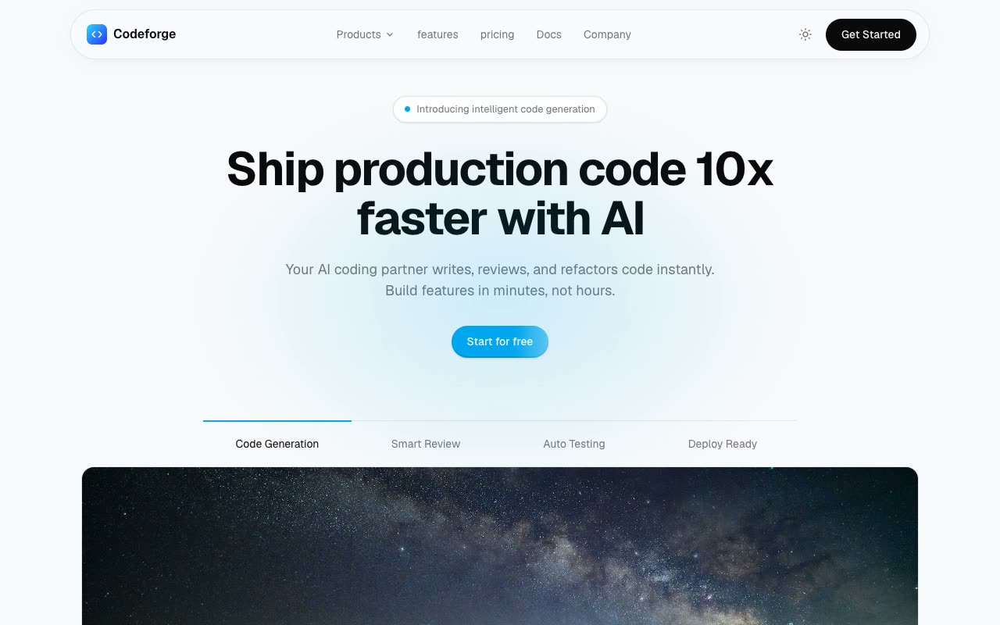

# CodeForge — AI Coding-Agent SaaS Landing Page Clone (Vanilla HTML/CSS/JS)

[](./demo.mp4)

A self-contained, single-page clone of the Magic UI **CodeForge** SaaS marketing template — a clean, light-theme landing page for an AI coding agent built on the Magic UI motion vocabulary. It features a sticky blur navbar with light/dark theme toggle, a hero with shimmer button and feature tabs over a radial blue glow, a startup logo cloud, an animated terminal typewriter card, a red/green code-diff review card, MCP and parallel-agents cards, a dotted world map, three auto-scrolling testimonial marquee columns, a scroll-velocity skewed text band, a monthly/annual pricing toggle, a FAQ accordion, and IntersectionObserver scroll-reveal entrance animations. Built with plain HTML, CSS, and vanilla JavaScript (no build step), using vendored Geist and Geist Mono fonts, a vendored Unsplash hero image, and randomuser avatars under `assets/`. Generated with Claude Fable 5.

## Run

No build step — serve the folder with any static server and open `index.html`:

```sh
python3 -m http.server
```

Then visit the printed URL (e.g. `http://localhost:8000`).

## Verify

There is no automated test script. Verify visually against `demo.mp4`, which shows the page in motion — the navbar blur, theme toggle, terminal typewriter, testimonial marquees, velocity scroll band, pricing toggle, FAQ accordion, and scroll-reveal animations.

`prompt.md` holds the full build spec (palette, type scale, layout, and interactions), and `demo.mp4` shows the result in motion.

## Credits

Faithful clone of an existing design, recreated for study/learning. All credit for the original design goes to its creators.

**Original:** Magic UI (CodeForge template) — <https://codeforge-magicui.vercel.app/>

---

Part of the [Templates](../../README.md) collection in the [claude-directory](../../../README.md) — an open-source gallery of AI-generated UI built with Claude Fable 5. [Browse the live gallery](https://pulkitxm.com/claude-directory).
