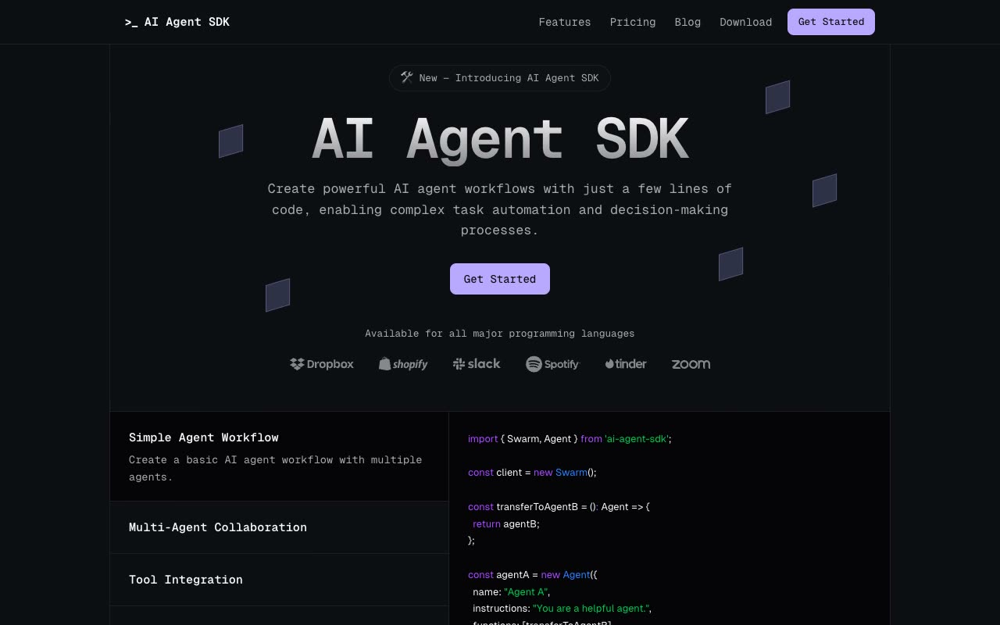

# AI Agent SDK — Magic UI "devtool" Startup Landing Page Clone (HTML + CSS + Vanilla JS)

[](./demo.mp4)

A pixel-faithful, same-to-same clone of the Magic UI "devtool" AI Agent SDK startup template — a dark-themed developer-tool / SaaS landing page with a near-black background, violet accent, Geist Sans + Geist Mono type, animated floating 3D hero cubes, a scrolling testimonials marquee, a yearly/monthly pricing toggle, count-up stats, and blur-in / fade-up scroll entrance animations driven by IntersectionObserver. It is a five-page static site — a long marketing home (`index.html`), a download page (`download.html`, a faithful reproduction of the source's Next.js 404), a blog index (`blog.html`), and three blog posts under `blog/` (How Dev AI?, Why Dev AI?, Introducing Dev AI). Built as plain HTML + CSS + vanilla JS with no build step. Generated with Claude Fable 5.

## Run

No build step. Serve the folder with any static server, for example:

```sh
python3 -m http.server
```

Then open <http://localhost:8000/> in your browser. Runs fully offline — fonts and all portrait/cover images are vendored locally into `assets/`.

## Notes

- Pages: `index.html` (home), `download.html`, `blog.html`, and `blog/how-dev-ai.html`, `blog/why-dev-ai.html`, `blog/introducing-dev-ai.html`.
- `download.html` intentionally reproduces the standard Next.js 404 ("This page could not be found." on a white background), matching the live source's `/download` route rather than inventing an install page.
- `main.js` holds the vanilla-JS interactions: mobile menu toggle, BlurFade entrance via IntersectionObserver, the testimonials marquee, pricing toggle, and stat count-up.
- `prompt.md` holds the full build spec; `demo.mp4` shows the site in motion.

## Credits

Faithful clone of an existing design, recreated for study/learning. All credit for the original design goes to its creators.

**Original:** Magic UI (devtool startup template) — <https://devtool-magicui.vercel.app/>

---

Part of the [Templates](../../../) collection in the [claude-directory](../../../../) — an open-source gallery of AI-generated UI built with Claude Fable 5. [Browse the live gallery](https://pulkitxm.com/claude-directory).
