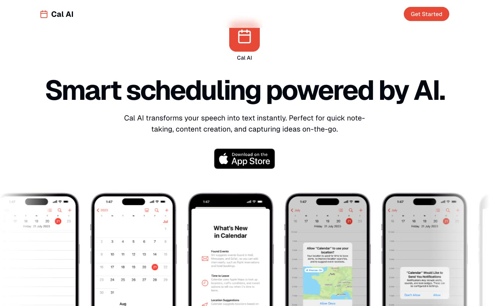

# Cal AI — Mobile App Landing Page Template (Vanilla HTML/CSS/JS, Magic UI clone)

[](./demo.mp4)

A self-contained, pixel-faithful clone of the Magic UI "Mobile" app-landing template (the "Cal AI" demo) for a fictional AI scheduling app, rebuilt as plain HTML, CSS, and vanilla JavaScript with every asset vendored locally and no build step. It pairs a clean white layout and coral-red accent with Geist Sans / Geist Mono type and a full set of animated sections: a centered hero with an App Store badge, a scroll-driven horizontal iPhone-mockup marquee, alternating sticky feature rows, a bento benefits block, an Embla-style benefits carousel, a four-column vertical testimonial marquee, two-tier pricing, a height-animated FAQ accordion, and a floating-tweet CTA, all with IntersectionObserver scroll reveals and pause-on-hover marquees. Useful as a startup/SaaS mobile-app marketing landing page reference. Stack: vanilla HTML + CSS + JavaScript, no framework and no build tooling. Generated with Claude Fable 5.

## Run

This is a fully static, offline site — no build, no dependencies. Serve the folder with any static server and open it in the browser:

```sh
python3 -m http.server 8000
# then open http://localhost:8000/index.html
```

You can also open `index.html` directly in a browser. All fonts, images, avatars, and icons are vendored under `assets/`, so it works entirely offline.

## Verify

There is no test harness. Verify visually:

- Serve the folder and confirm the page loads with no network requests beyond the local files (check the browser devtools Network tab — everything resolves under `./assets/` and `./css/`).
- Scroll to confirm the two hero phone rows drift horizontally, section content fades in, the testimonial columns auto-scroll vertically (and pause on hover), the benefits carousel arrows page through slides, and the FAQ items expand/collapse with a height animation.

## Notes

- `prompt.md` holds the full build spec (palette, type scale, animation details, and section-by-section layout).
- `demo.mp4` shows the template in motion; `poster.jpg` is its thumbnail.
- All interactive behavior lives in `js/main.js` (hero marquee, carousel, testimonial columns, FAQ accordion, floating tweets, scroll reveals); styling is in `css/styles.css`.

## Credits

Faithful clone of an existing design, recreated for study/learning. All credit for the original design goes to its creators.

**Original:** Magic UI — <https://mobile-magicui.vercel.app/>

---

Part of the [Templates](../../../README.md) collection in the [claude-directory](../../../../README.md) — an open-source gallery of AI-generated UI built with Claude Fable 5. [Browse the live gallery](https://pulkitxm.com/claude-directory).
