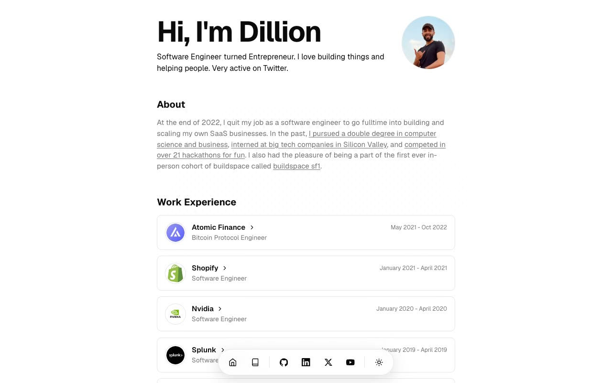

# Magic UI Portfolio — Developer Portfolio Template Clone (Vanilla HTML/CSS/JS)

[](./demo.mp4)

A self-contained, no-build reproduction of the open-source Magic UI portfolio template: a single-author developer portfolio with a long-scrolling home page (hero, about, work experience, education, skills, projects, a hackathons timeline, and contact), a paginated blog index, and seven Markdown-style blog posts. It features a light/dark theme toggle, a floating bottom pill dock (home, blog, social links, and the theme switch), and per-element staggered blur-fade entrance animations over a subtle dotted-grid background. Built entirely with plain HTML, CSS, and vanilla JavaScript — no build step, all assets vendored locally. Generated with Claude Fable 5.

## Run

No build step is required. Serve the folder with any static file server, for example:

```sh
python3 -m http.server
```

Then open <http://localhost:8000/index.html> in your browser. The blog index lives at `blog.html`, and each post is its own `blog-*.html` page.

## Pages

- `index.html` — single-page home (hero, about, work experience, education, skills, projects, hackathons timeline, contact, floating dock).
- `blog.html` — paginated blog index (7 posts across 2 pages).
- `blog-testing-react-apps.html`, `blog-api-design-principles.html`, `blog-git-workflow-guide.html`, `blog-typescript-best-practices.html`, `blog-nextjs-performance-tips.html`, `blog-building-design-systems.html`, `blog-remote-work-productivity.html` — the seven blog posts.

The full build spec lives in `prompt.md`, and `demo.mp4` shows the template in motion.

## Credits

Faithful clone of an existing design, recreated for study/learning. All credit for the original design goes to its creators.

**Original:** Magic UI Portfolio (dillionverma/portfolio) — <https://portfolio-magicui.vercel.app/>

---

Part of the [Templates](../../../README.md) collection in the [claude-directory](../../../../README.md) — an open-source gallery of AI-generated UI built with Claude Fable 5. [Browse the live gallery](https://pulkitxm.com/claude-directory).
