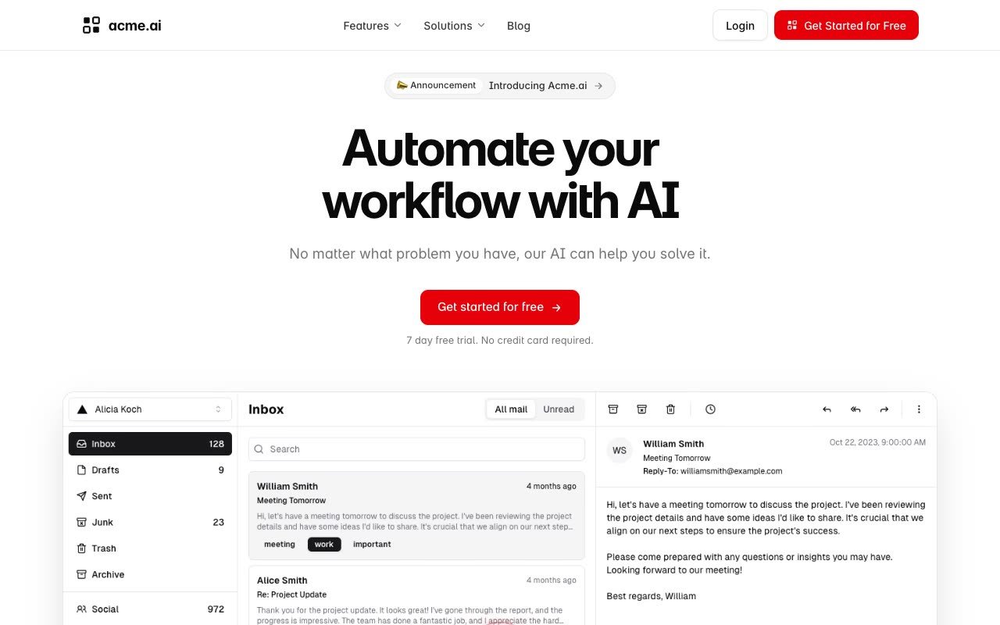

# acme.ai — SaaS Startup Landing Page Template Clone (Vanilla HTML/CSS/JS)

[](./demo.mp4)

A pixel-faithful, self-contained reproduction of the Magic UI "acme.ai" SaaS / AI-startup landing template, rebuilt as a plain multi-page website with no build step. It is a clean light-theme marketing site for a fictional product ("Automate your workflow with AI") spanning five pages — a long single-column home page, a blog index, a blog article, and login / signup auth cards — with a sticky glass header, a single bold red accent, rounded cards, soft shadows, marquees, a testimonial carousel, feature tabs, a FAQ accordion, a monthly/yearly pricing switch, a hero play-button lightbox, and IntersectionObserver scroll fade-in animations. Built with vanilla HTML, CSS, and JavaScript, with Inter (woff2), company logos, avatars, and dashboard imagery all vendored locally under `assets/`. Generated with Claude Fable 5.

## Pages

- `index.html` — home (hero, logo cloud, problem/solution, how it works, testimonials, feature tabs, pricing, FAQ, CTA, footer)
- `blog.html` — blog index
- `blog/introducing-acme-ai.html` — blog article
- `login.html` — login auth card
- `signup.html` — signup auth card

## Run

No build step. Serve the folder with any static server and open the home page:

```sh
python3 -m http.server 8000
# then open http://localhost:8000/index.html
```

The full build spec lives in `prompt.md`, and `demo.mp4` shows the site in motion.

## Credits

Faithful clone of an existing design, recreated for study/learning. All credit for the original design goes to its creators.

**Original:** Magic UI (SaaS template) — <https://saas-magicui.vercel.app/>

---

Part of the [Templates](../) collection in the [claude-directory](../../) — an open-source gallery of AI-generated UI built with Claude Fable 5. [Browse the live gallery](https://pulkitxm.com/claude-directory).
