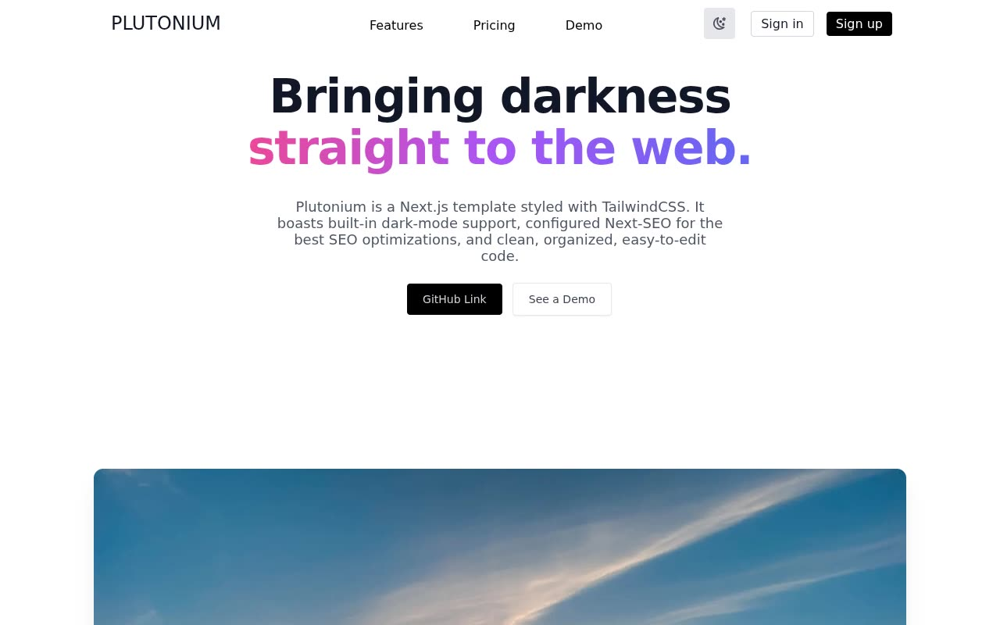

# Plutonium — Next.js Startup Landing Page Template Clone (Vanilla HTML/CSS/JS)

[](./demo.mp4)

A pixel-faithful reproduction of "Plutonium," a free, open-source Next.js 11 + TailwindCSS 2 marketing/startup landing-page template by Saurish Srivastava, rebuilt as a self-contained static site in plain HTML, CSS, and vanilla JavaScript with no build step. It ships the single-page marketing site — sticky blurred-glass nav with mobile hamburger menu, gradient hero headline with a hover-scaling hero photo, a grayscale-to-color sponsor logo grid, a features section with hover-scaling images, and a pricing section with a highlighted "Freelancer" plan — plus the template's original easter egg: the nav's "Demo" link and the hero's "See a Demo" button both route to the reused 404 page. Also included is a class-based, system-preference-aware, no-flash dark-mode toggle persisted to `localStorage`, matching the original template's `next-themes` behavior. Generated with Claude Fable 5.

The template's advertised live demo domain (`plutonium.saurish.com`) currently returns HTTP 503 with a broken TLS chain — a dead, unclaimed Vercel custom domain with no working hosted preview anywhere. This clone was reconnoitered by cloning the original repository, installing dependencies, and running a local production build (`next build && next start`, with `NODE_OPTIONS=--openssl-legacy-provider` for Next.js 11's Webpack 4 on modern Node) as a stand-in for the dead hosted site.

## Pages

- `index.html` — home page: sticky header/nav, hero, sponsors (`#sponsors`), features (`#features`), pricing (`#pricing`), and footer.
- `404.html` — the "demo" page, reusing the same header/footer, with large 404 digits, an explanatory paragraph revealing the page is intentionally the template's demo destination, and a "Return Home" button.
- `styles.css` — shared styling: light/dark palettes, gradient headline treatments, frosted-glass sticky nav, custom scrollbar, and hover/transition effects.
- `theme.js` — dark-mode toggle (persisted to `localStorage`, system-preference aware) and mobile hamburger-menu interactivity.

## Run

This project has no build step — it is a set of static files. Serve the folder over HTTP and open `index.html`:

```sh
python3 -m http.server 8000
# then open http://localhost:8000/index.html
```

You can also open `index.html` directly in a browser, though a local server is recommended so relative links and assets resolve reliably.

The full build spec, including the exact color palette, type scale, and layout for every section, is in `prompt.md`, and `demo.mp4` (with `poster.jpg`) shows the template in motion.

## Credits

Faithful clone of an existing design, recreated for study/learning. All credit for the original design goes to its creators.

**Original:** minor/plutonium (Saurish Srivastava) — <https://github.com/minor/plutonium>

---

Part of the [Templates](../../../) collection in the [claude-directory](../../../../) — an open-source gallery of AI-generated UI built with Claude Fable 5. [Browse the live gallery](https://pulkitxm.com/claude-directory).
