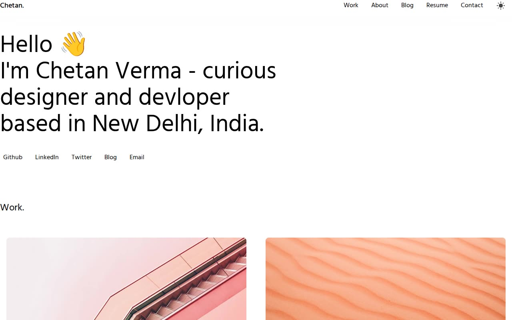

# React Portfolio Template Clone — Minimalist Developer Portfolio (Vanilla HTML + CSS + GSAP)

[](./demo.mp4)

A pixel-faithful static HTML/CSS/vanilla JS recreation of Chetan Verma's React Portfolio Template — a minimalist, typography-forward personal portfolio site. The clone reproduces the full multi-page layout (home, blog listing, blog post, and resume), a pink-purple radial gradient decorative element, a custom SVG cursor that follows the mouse on fine-pointer devices, and a light/dark theme toggle backed by `localStorage`. All assets (Hind font, project images, blog images) are vendored locally — no build step, no network dependencies, runs fully offline. Generated with Claude Fable 5.

## Run

This project is plain HTML/CSS/JS with no build step. Serve the folder with any static file server:

```sh
python3 -m http.server 8080
```

Then open `http://localhost:8080` in your browser.

Alternatively, open `index.html` directly in a browser, though a local server is recommended so that navigation between pages works correctly.

## Features

- **Four pages** — Home (`index.html`), Blog listing (`blog.html`), Blog post (`blog/firstblog.html`), and Resume (`resume.html`).
- **Light / dark mode** — toggled by clicking the sun icon in the nav; preference stored in `localStorage` and applied before first paint to avoid flash.
- **Custom SVG cursor** — a 30×30 px SVG circle tracks the mouse; hidden automatically on touch/coarse-pointer devices.
- **Pink-purple gradient decorations** — a radial-gradient circle (`#f86bdf` → `rgba(107,107,248,0.8)`) appears at the top and bottom of every page.
- **Sticky/fixed navigation** — desktop sticky header with scroll-to-section links (Work, About, Contact); mobile fixed header with a full-height hamburger popover.
- **GSAP entrance animations** — hero headings and page titles slide in from `y: 40` with opacity fade on load.
- **Work section** — 2-column grid of 6 projects, each with a tall cover image (600 px) that scales to `1.1×` on hover inside an `overflow: hidden` container.
- **Services section** — 2-column grid of 4 service cards with hover highlight and `scale(1.05)` transition.
- **Blog listing** — responsive 3/2/1-column grid of 3 post cards with cover image, title, preview text, and date.
- **Blog post page** — full-width hero image, large title, and a styled markdown body (`markdown-class`) with headings, lists, blockquote, inline code, and images.
- **Resume page** — centered card with name, bio, social links, experience entries with bullet points, education, and a 3-column skills grid (Languages, Frameworks, Others).
- **Hind typeface** — vendored locally in `assets/fonts/` (weights 400, 500, 700 as `.woff2`) so the site loads offline with no Google Fonts request.
- **Smooth hover transitions** — all interactive elements use `cubic-bezier(0,0,0.2,1)` at `0.3 s`.

## Project files

| File | Purpose |
|---|---|
| `index.html` | Home page — hero, work, services, about, contact |
| `blog.html` | Blog listing page |
| `blog/firstblog.html` | Individual blog post with markdown body |
| `resume.html` | Resume / CV page |
| `styles.css` | All styles — layout, theming, responsive breakpoints |
| `assets/` | Vendored fonts, SVG icons, project and blog images |

`prompt.md` holds the full build specification and `demo.mp4` shows the site in motion.

## Credits

Faithful clone of an existing design, recreated for study/learning. All credit for the original design goes to its creators.

**Original:** Chetan Verma's React Portfolio Template — <https://react-portfolio-template.netlify.app/>

---

Part of the [Templates](../) collection in the [claude-directory](../../../../) — an open-source gallery of AI-generated UI built with Claude Fable 5. [Browse the live gallery](https://pulkitxm.com/claude-directory).
