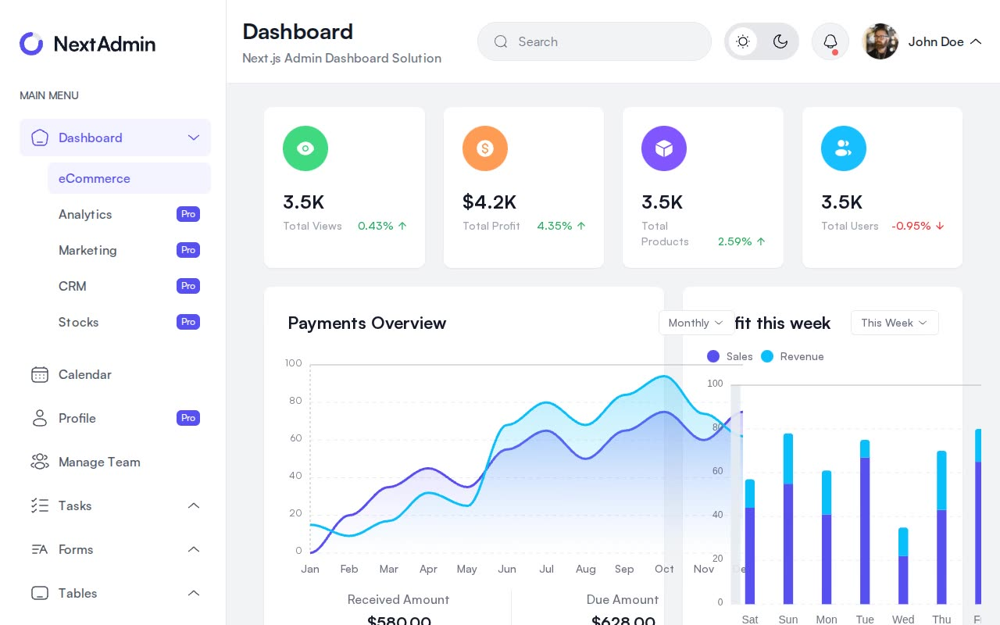

# NextAdmin — Multi-Page Admin Dashboard Template Clone (Vanilla HTML + CSS + JS + Tailwind)

[](./demo.mp4)

A pixel-faithful, self-contained reproduction of the [NextAdmin](https://demo.nextadmin.co/) admin dashboard kit, rebuilt as plain HTML + CSS + vanilla JavaScript with no build step or Node.js required. The template spans 51 static pages covering five dashboard variants, a full UI elements showcase, task management, forms, tables, charts, auth screens, and utility pages — all sharing a sticky sidebar with accordion navigation and a sticky top header. Light and dark mode are fully supported, persisted to `localStorage`, and respect the system `prefers-color-scheme` preference. Assets — the Satoshi font (WOFF2, all weights), Tailwind CSS, and pre-rendered ApexCharts SVGs — are vendored locally so the project works entirely offline. Generated with Claude Fable 5.

## Pages (51 total)

- **Dashboards (5):** eCommerce (`index.html`), Analytics, Marketing, CRM, Stocks
- **Productivity:** Calendar, Profile, Manage Team, Tasks (List & Kanban)
- **Forms (4):** Form Elements, Pro Form Elements, Form Layout, Pro Form Layout
- **Tables (3):** Basic, Pro, Data Tables
- **Pages group (7):** Settings, File Manager, Pricing Tables, Error Page, Team, Terms & Conditions, Mail Success
- **Messaging & Finance:** Messages, Inbox, Invoice
- **Charts (2):** Basic Chart, Advanced Chart
- **UI Elements (18):** Accordion, Alerts, Badge, Breadcrumbs, Buttons, Buttons Group, Cards, Carousel, Dropdowns, Images, Modals, Notifications, Pagination, Popovers, Progress, Tabs, Tooltips, Videos
- **Auth (2):** Sign In, Sign Up
- **Utility (2):** Coming Soon, Under Maintenance

## Run

No install step is needed. Serve the project folder with any static file server and open it in a browser.

```sh
cd /path/to/nextadmin-dashboard
python3 -m http.server 8080
```

Then open http://localhost:8080/ in a browser.

Alternatively, open `index.html` directly in a browser (some browsers block local font loading over `file://`; the HTTP server approach is recommended).

## Theme

Dark/light mode is toggled via the sun/moon button in the top header. The chosen theme is written to `localStorage` under the key used by the vanilla JS toggle, and the initial state falls back to the OS-level `prefers-color-scheme` if no preference has been saved. No server round-trip is needed — the class is applied before first paint.

## Stack

| Layer | Technology |
|---|---|
| Markup | Vanilla HTML5 (one `.html` file per page) |
| Styles | Tailwind CSS (vendored, utility-first) |
| Typography | Satoshi (self-hosted WOFF2, weights 300–900) |
| Charts | ApexCharts (pre-rendered inline SVG) |
| Interactivity | Vanilla JavaScript (sidebar accordion, theme toggle, dropdowns, modals, tabs, carousels) |
| Build | None — static files only |

## Reference

`prompt.md` in this folder contains the full build specification. `demo.mp4` shows the template in motion.

## Credits

Faithful clone of an existing design, recreated for study/learning. All credit for the original design goes to its creators.

**Original:** NextAdmin — https://demo.nextadmin.co/

---

Part of the [NextAdmin](../) collection in the [Templates](../../../) category of [claude-directory](../../../../) — an open-source gallery of AI-generated UI built with Claude Fable 5. [Browse the live gallery](https://pulkitxm.com/claude-directory).
