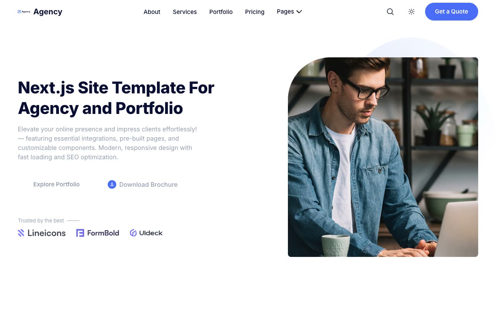

# Agency — 23-Page Marketing & Portfolio Site Template Clone (Vanilla HTML/CSS/JS)

[](./demo.mp4)

A self-contained, pixel-faithful clone of the **Agency** Next.js marketing/portfolio site template (built on the Startup/GrayGrids design system), rebuilt as plain HTML, CSS, and vanilla JavaScript with **no build step**. It pairs a white-canvas, deep-navy-accented palette and Inter type with a sticky/blurred header, scrollspy nav, a "Pages" dropdown, portfolio filter pills, and scroll/entrance animations across 23 full pages — a one-page marketing home plus service hub + 3 detail pages, portfolio hub + 4 detail pages, blog grid + 7 posts, contact, docs, 404, and sign-in/sign-up. All fonts, images, and icons are vendored locally so the site runs completely offline.

## Pages

All 23 pages share the same sticky header and dark-navy footer:

- `index.html` — Home: hero, about, "what we do" service cards, recent-works portfolio grid with filter pills, client logo strip, newsletter CTA, team, pricing, testimonials, latest-blogs preview, contact form.
- `service.html` — Service hub grid linking to the 3 service detail pages.
- `service-website-development.html`, `service-graphic-design.html`, `service-app-development.html` — Service detail pages (sidebar nav + numbered subsections).
- `portfolio.html` — Portfolio hub grid linking to the 4 portfolio detail pages.
- `portfolio-startup-landing-page.html`, `portfolio-job-portal-landing-page.html`, `portfolio-saas-landing-page.html`, `portfolio-business-corporate-template.html` — Portfolio detail pages (screenshot, description, project-info + download-files sidebar).
- `blog.html` — Blog grid of all 7 posts.
- `blog-post-mern-stack.html`, `blog-post-uiux.html`, `blog-post-mern-stack-2.html`, `blog-post-uiux-branding.html`, `blog-post-saas-startups.html`, `blog-post-coding-speed.html`, `blog-post-webhook.html` — Individual blog posts (author, tags, pulled-quote callout, share row).
- `contact.html` — Standalone contact form.
- `docs.html` — Docs landing (left nav list + welcome content).
- `404.html` — Not-found page.
- `signin.html` / `signup.html` — Auth pages with social sign-in buttons and email/password forms.

## Run

There is no build step or dependencies. Serve the folder over a static HTTP server so relative asset paths resolve correctly, then open the site in a browser:

```sh
python3 -m http.server 8000
# then open http://localhost:8000/
```

Any static file server works (for example `npx serve`). The full build spec lives in `prompt.md`, and `demo.mp4` (poster: `poster.jpg`) shows the site and its interactions in motion.

## Credits

Faithful clone of an existing design, recreated for study/learning. All credit for the original design goes to its creators.

**Original:** Next.js Templates — <https://agency.demo.nextjstemplates.com/>

---

Part of the [Templates](../../../) collection in the [claude-directory](../../../../) — an open-source gallery of UI experiments and template clones. [Browse the live gallery](https://pulkitxm.com/claude-directory).
