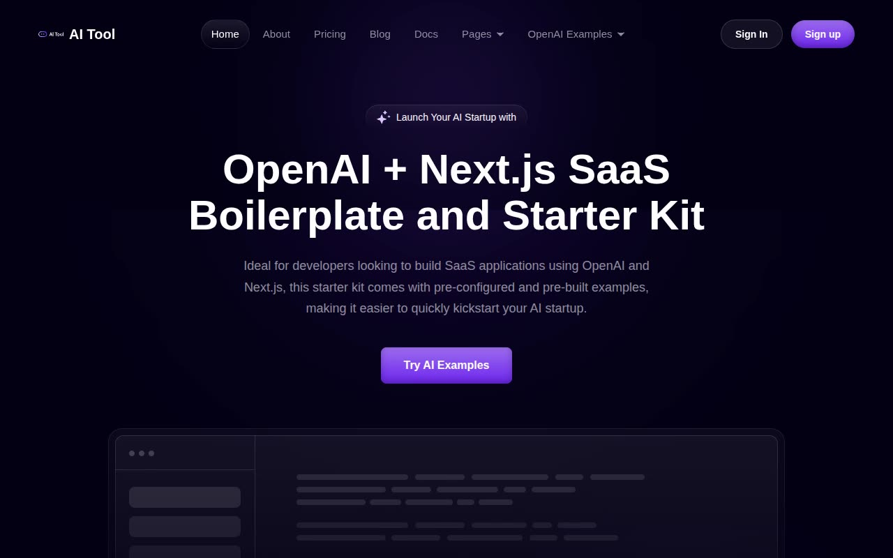

# AI Tool — AI SaaS Landing Page Template Clone (Vanilla HTML + CSS + JS)

[](./demo.mp4)

A pixel-faithful, no-build-step reproduction of the AI Tool template from Next.js Templates — a dark-themed, purple-accented SaaS landing page starter kit designed for developers building OpenAI-powered products. The clone covers all 18 pages of the original: home, about, pricing, blog (listing and three full articles), docs, an AI examples gallery with six interactive tool pages, sign-in and sign-up auth pages, and an error page. Visual details reproduced include the deep-navy (`rgb(3, 0, 20)`) background, vivid `#8646f4` purple primary accent, card hover glow with mouse-follow pseudo-element effect, infinite horizontal testimonial marquee, sticky glass-blur header, and scroll-triggered fade-in animations via IntersectionObserver. Built entirely in plain HTML, CSS, and vanilla JavaScript — no framework, no bundler, no Node. Generated with Claude Fable 5.

## Pages

| File | Route |
|------|-------|
| `index.html` | Home — hero, features, pricing, testimonials, clients marquee, footer |
| `about.html` | About — stats banner, features grid, team section |
| `pricing.html` | Pricing — plan cards (Starter / Medium / Business), FAQ accordion |
| `blog.html` | Blog listing — card grid with thumbnails, excerpts, authors |
| `blog-mern.html` | Blog post — MERN Stack article |
| `blog-ui-components.html` | Blog post — Best UI Components article |
| `blog-uiux.html` | Blog post — Power of UI/UX article |
| `docs.html` | Docs — sidebar navigation + main content area |
| `ai-examples.html` | AI Examples gallery — six tool cards |
| `ai-examples-content-writing.html` | Content Writing Tool interface |
| `ai-examples-business-name.html` | Business Name Generator interface |
| `ai-examples-article-title.html` | Article Title Writer interface |
| `ai-examples-product-name.html` | Product Name Generator interface |
| `ai-examples-spreadsheet.html` | Spreadsheet Creator interface |
| `ai-examples-interview-question.html` | Interview Questions Generator interface |
| `auth-signin.html` | Sign In — form with Google/GitHub OAuth buttons |
| `auth-signup.html` | Sign Up — name/email/password form |
| `error.html` | Error page with return-home CTA |

## Run

No build step is required. Open any page directly in a browser:

```sh
open index.html
```

Or serve the folder with any static file server:

```sh
# Python (built-in)
python3 -m http.server

# Node (npx, no install)
npx serve .
```

Then visit `http://localhost:8000` (Python) or the URL printed by `npx serve`.

## Notes

- All styles are written in plain CSS with custom properties; no preprocessor or utility framework is used.
- Fonts are loaded from Google Fonts (`Plus Jakarta Sans`, weights 200–800).
- The card-hover glow effect tracks the mouse position via `mousemove` listeners that set `--mouse-x` / `--mouse-y` CSS variables consumed by `::before`/`::after` pseudo-elements.
- The testimonial marquee runs via a CSS `@keyframes` animation with duplicated content for seamless looping.
- `prompt.md` holds the full build specification. `demo.mp4` shows the finished clone in motion.

## Credits

Faithful clone of an existing design, recreated for study/learning. All credit for the original design goes to its creators.

**Original:** Next.js Templates — <https://ai-tool.nextjstemplates.com/>

---

Part of the [Next.js Templates](../) collection — within the [Templates](../../../) gallery in [claude-directory](../../../../) — an open-source gallery of AI-generated UI built with Claude Fable 5. [Browse the live gallery](https://pulkitxm.com/claude-directory).
