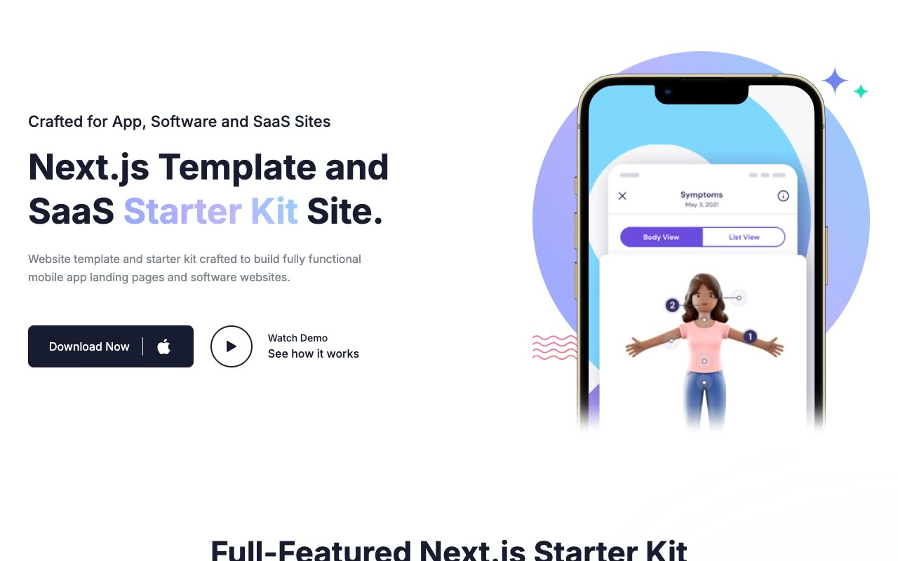

# Appline — App/SaaS Landing Page Template Clone (Vanilla HTML/CSS/JS)

[](./demo.mp4)

A self-contained, pixel-faithful clone of the **Appline** Next.js App & SaaS starter kit, rebuilt as plain HTML, CSS, and vanilla JavaScript with **no build step and no dependencies**. The one-page marketing home combines a phone-mockup hero, a 3x2 feature card grid, alternating "about" showcase sections, a monthly/yearly pricing toggle, a Swiper.js app-screenshots carousel, testimonial cards, an FAQ accordion, a blog preview grid, a client-logo strip, and a newsletter signup — all wrapped in a sticky header with light/dark theme toggle and a shared footer. Ten total pages (home, blog index, three blog post details, blog author, docs, sign in, sign up, and a custom 404) reproduce the full site.

## Pages

Ten static pages share the same sticky/transparent-on-scroll header and footer:

- `index.html` — Home: hero, features, two about/showcase sections, how-it-works, pricing, app screenshots carousel, download CTA, testimonials, FAQ, latest blog posts, client logos, newsletter.
- `blog.html` — Blog index: page header banner plus a grid of all 3 blog post cards.
- `blog-post-1.html`, `blog-post-2.html`, `blog-post-3.html` — Blog post detail pages: hero image, title, author/date meta, rich-text body, share row, author bio card.
- `blog-author.html` — Author profile (avatar, bio, socials) plus a grid of that author's posts.
- `docs.html` — Docs-style informational page with a banner header.
- `signin.html` / `signup.html` — Centered auth cards with Google/GitHub social buttons, form fields, and validation states.
- `404.html` — Custom error page with a back-to-home button.

## Interactions

- **Sticky header** — transparent at page top, becomes a solid bar with shadow on scroll; mobile hamburger opens a slide/fade nav panel; "Pages" nav item opens a dropdown submenu.
- **Light/dark theme toggle** — sun/moon icon swaps a `light`/`dark` class on `<html>` and persists the choice via `localStorage`.
- **Pricing monthly/yearly toggle** — animates a sliding thumb and swaps the displayed plan prices.
- **FAQ accordion** — click to expand/collapse an answer (height + opacity transition, plus/minus icon swap), only one item open at a time.
- **App screenshots carousel** — Swiper.js slider with hover-fill prev/next arrow buttons and clickable pagination dots.
- **Scroll-reveal entrance animations** — sections fade/slide in as they enter the viewport via an Intersection Observer.
- **Newsletter and auth forms** — client-side focus/validation states reproduced as static demo behavior since the original is a Next.js demo without a live backend.

## Run

There is no build step or dependencies. Serve the folder over any static HTTP server, then open the site in a browser:

```sh
python3 -m http.server 8000
# then open http://localhost:8000/
```

Any static file server works (for example `npx serve`). The full build spec lives in `prompt.md`, and `demo.mp4` (poster: `poster.jpg`) shows the site and its interactions in motion.

## Credits

Faithful clone of an existing design, recreated for study/learning. All credit for the original design goes to its creators.

**Original:** nextjstemplates.com — Appline — <https://appline.demo.nextjstemplates.com>

---

Part of the [Templates](../../../) collection in the [claude-directory](../../../../) — an open-source gallery of UI experiments and template clones. [Browse the live gallery](https://pulkitxm.com/claude-directory).
