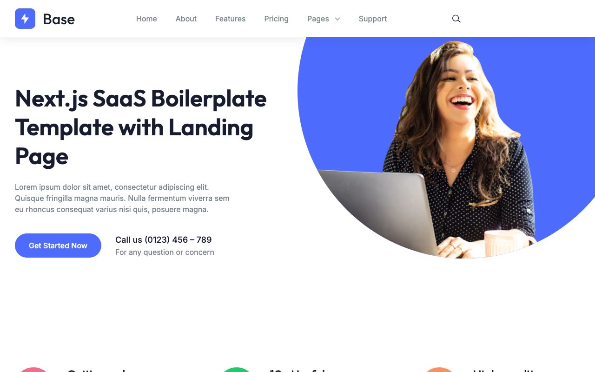

# Base — Next.js SaaS Boilerplate Landing Page Template Clone (Vanilla HTML/CSS/JS)

[](./demo.mp4)

A self-contained, pixel-faithful clone of **Base**, the Next.js SaaS boilerplate marketing template from nextjstemplates.com, rebuilt as plain HTML, CSS, and vanilla JavaScript with **no build step**. It reproduces the full 13-page site — the SaaS landing page (hero, features, pricing, projects, testimonials, team, brands, blog preview, contact, CTA), a full blog section (index, six posts, one author page), the auth flow (sign in, sign up, forgot password), and a 404 error page — with a working light/dark theme toggle, a sticky/scroll header, a mobile hamburger menu, a hover/click "Pages" dropdown, a pricing monthly/annually toggle, portfolio filter pills, and a Swiper-powered testimonial carousel.

## Pages

All 13 pages share the same sticky header (logo, nav, "Pages" dropdown, dark-mode toggle, sign in/up links) and footer (link columns, newsletter form, bottom bar):

- `index.html` — Home: hero, "Why Choose Us", feature grid, pricing, latest projects (filterable), testimonials, team + stats counters, brand logos, blog preview, contact form, CTA banner.
- `blog.html` — Blog index: 6-card post grid.
- `blog-9-simple-ways-to-improve-your-design-skills.html`, `blog-free-advertising-for-your-online-business.html`, `blog-tips-to-quickly-improve-your-coding-speed.html`, `blog-lorem-ipsum-dolor-sit-amet-consectetur-adipiscing-elit.html`, `blog-lorem-ipsum-dolor-sit-amet-consectetur-adipiscing-seddo-eiusmod.html`, `blog-lorem-ipsum-dolor-sit-amet-consectetur-adipiscing.html` — six individual blog post pages, sharing one template (feature image, title, author/date/category meta, body copy, share-on social row).
- `blog-author-juhan-ahamed.html` — Blog author page: profile block plus a grid of the author's posts.
- `auth-signin.html` — Sign in: social buttons (Google/GitHub), magic-link/password tab toggle, email field.
- `auth-signup.html` — Sign up: name/email/password fields plus social buttons.
- `auth-forget-password.html` — Forgot password: email field and reset submit.
- `error.html` — 404 page with the same decorative background as the auth pages.

## Theme toggle

Dark/light mode is implemented with no framework:

- `assets/js/theme-boot.js` runs synchronously in `<head>` (before first paint) to read the `base-theme` key from `localStorage` (or fall back to `prefers-color-scheme`) and add the `dark` class to `<html>` immediately, avoiding a flash of the wrong theme.
- `assets/js/main.js`'s `initThemeToggle()` wires the header's toggle button to flip the `dark` class and persist the choice back to `localStorage` under `base-theme`.

## Interactions

All behavior lives in `assets/js/main.js` (no framework, no bundler), each wired up on `DOMContentLoaded`:

- **Theme toggle** — `initThemeToggle()`, described above.
- **Sticky/scrolled header** — `initStickyHeader()` listens for scroll and swaps the header from transparent/absolute (over the hero) to a solid background with shadow.
- **Mobile hamburger menu** — `initMobileNav()` opens/closes a full-screen nav overlay and closes it again on link click.
- **"Pages" dropdown submenu** — `initSubmenu()` reveals the Blog/Sign in/Sign up/404 submenu on hover (desktop) or click (mobile).
- **Smooth in-page scrolling** — `initSmoothScroll()` intercepts anchor links (e.g. `#about`, `#features`, `#pricing`, `#support`) for smooth scrolling to sections.
- **Scroll-reveal entrance animations** — `initReveal()` uses `IntersectionObserver` to fade/translate `.animate_top` / `.animate_left` / `.animate_right` elements into view (falls back to instantly visible where unsupported), defined in `assets/css/custom.css`.
- **Pricing monthly/annually toggle** — `initPricingToggle()` switches the three plan cards' prices on the home page.
- **Portfolio filter pills** — `initPortfolioFilter()` filters the "Our Latest Projects" grid by category.
- **Testimonial carousel** — `initSwiperTestimonial()` drives a real Swiper instance (`assets/js/swiper-bundle.min.js`) with prev/next arrows and dot pagination, with `initTestimonialCarousel()` as a plain-JS fallback if Swiper isn't available.
- **Stats counters** — `initCounters()` animates the team-section stat numbers up from zero once they scroll into view, via `IntersectionObserver`.

## Run

There is no build step or dependencies to install. Serve the folder over any static HTTP server and open it in a browser:

```sh
python3 -m http.server 8000
# then open http://localhost:8000/index.html
```

Any static file server works (for example `npx serve`). Fonts (`assets/fonts/*.woff2`, Inter + Outfit), styles (`assets/css/*`), scripts (`assets/js/*`), and images (`images/*`) are all vendored locally, so the site runs fully offline. The full build spec lives in `prompt.md`, and `demo.mp4` (poster: `poster.jpg`) shows the site and its interactions in motion.

## Credits

Faithful clone of an existing design, recreated for study/learning. All credit for the original design goes to its creators.

**Original:** Next.js Templates ("Base" SaaS boilerplate) — <https://base.demo.nextjstemplates.com>

---

Part of the [Templates](../../../) collection in the [claude-directory](../../../../) — an open-source gallery of AI-generated UI built with Claude Fable 5. [Browse the live gallery](https://pulkitxm.com/claude-directory).
