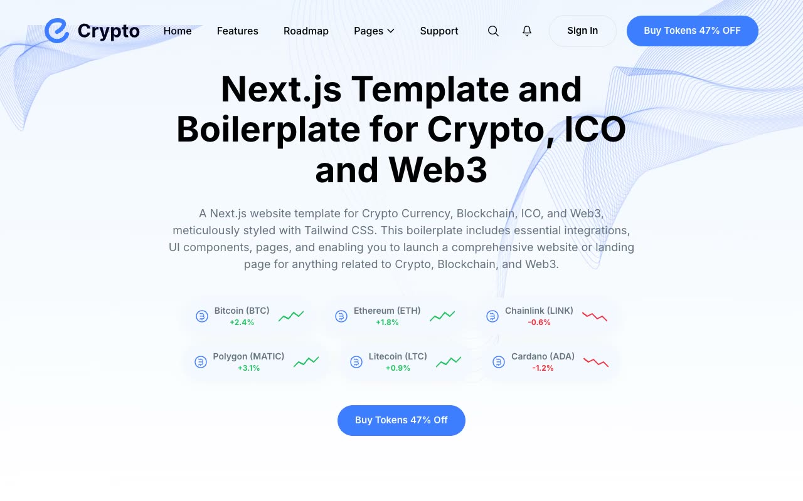

# Crypto — Next.js Crypto/ICO/Web3 Template Clone (Vanilla HTML/CSS/JS)

[](./demo.mp4)

A self-contained, pixel-faithful clone of the **Crypto** Next.js template for cryptocurrency, ICO, and Web3 landing sites, rebuilt as plain HTML, CSS, and vanilla JavaScript with **no build step**. It pairs a white canvas with a `#3e7dff` blue accent, soft light-blue section backgrounds, rounded cards, decorative gradient blob SVGs, and Inter type across 11 pages — a one-page marketing home (hero with live-style coin chips, partner logos, features, roadmap timeline, token-sale teaser, team, testimonials, FAQ accordion, app download CTA, newsletter, blog preview, contact form) plus a blog grid, 3 blog post pages, an author page, a dedicated token-sale page, a support page, and sign-in/sign-up/forgot-password auth pages. All fonts, images, and icons are vendored locally so the site runs completely offline, and the design system supports both light and dark variants via CSS custom properties.

## Pages

All 11 pages share the same sticky header (transparent at top, solid white + shadow on scroll, with a "Pages" dropdown) and footer:

- `index.html` — Home: hero with coin-change chips + inline SVG sparklines, partner-logo strip, features grid, token-sale teaser with donut chart, roadmap timeline, team, testimonials, download/app CTA, FAQ accordion, newsletter signup, recent blog preview, contact form.
- `blog.html` — Blog grid listing of all posts with pagination.
- `blog-post-1.html`, `blog-post-2.html`, `blog-post-3.html` — Individual blog post pages (author/date meta, article body, pulled quote, tags, share row, related posts).
- `blog-author.html` — Author profile page (avatar, bio, social links, grid of the author's posts).
- `token-sale.html` — Dedicated ICO/token-sale page: countdown, sale progress bar, tokenomics stats, buy-token CTA.
- `support.html` — Support/contact page with contact info cards and a message form.
- `signin.html` / `signup.html` / `forget-password.html` — Auth pages with social sign-in button and email/password forms.

## Run

There is no build step or dependencies. Serve the folder over a static HTTP server so relative asset paths resolve correctly, then open the site in a browser:

```sh
python3 -m http.server 8000
# then open http://localhost:8000/
```

Any static file server works (for example `npx serve`). The full build spec lives in `prompt.md`, and `demo.mp4` (poster: `poster.jpg`) shows the site and its interactions in motion.

## Credits

Faithful clone of an existing design, recreated for study/learning. All credit for the original design goes to its creators.

**Original:** NextJsTemplates — <https://crypto.demo.nextjstemplates.com>

---

Part of the [Templates](../../../) collection in the [claude-directory](../../../../) — an open-source gallery of UI experiments and template clones. [Browse the live gallery](https://pulkitxm.com/claude-directory).
