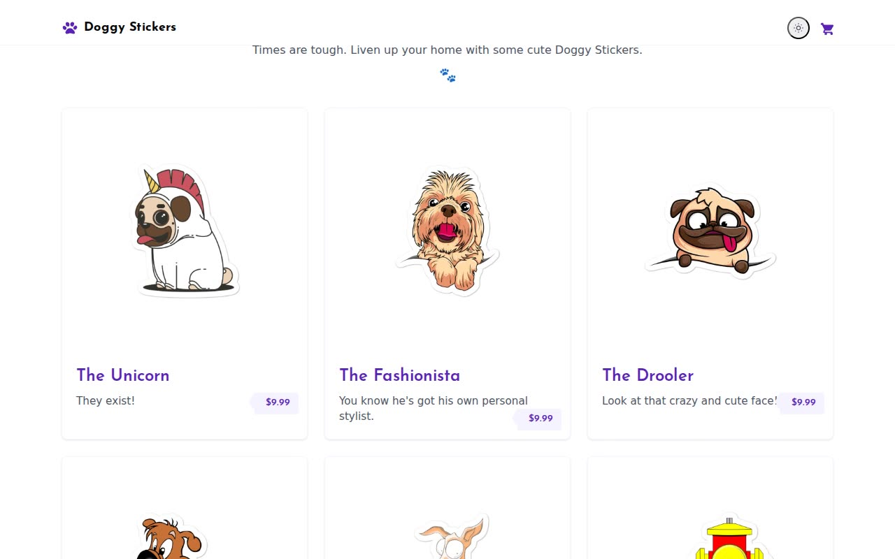

# Doggy Stickers — E-Commerce Sticker Store Clone (Vanilla HTML + CSS + JS, Tailwind Utility Classes)

[](./demo.mp4)

Doggy Stickers is a pixel-faithful, self-contained clone of [doggystickers.vercel.app](https://doggystickers.vercel.app/), a small Next.js-powered e-commerce demo store selling cartoon dog stickers, built by Bilal Tahir. The clone reproduces all three page templates — a catalog home page with an 11-product card grid, a shared product-detail template (image gallery/carousel, qty and size selectors, add-to-cart) reused across all 11 slugs, and a cart page with quantity steppers and per-row remove — using the same Tailwind v2 "violet" palette, Josefin Sans headings, and hover-state color transitions as the original. There is no build step: it's plain HTML, CSS, and JS with a `localStorage`-backed cart standing in for the original's private Shopify checkout. Generated with Claude Fable 5.

## Pages

- `index.html` — catalog home: sticky header (logo + cart badge), hero, and the 11-product grid (The Unicorn, The Fashionista, The Drooler, The Player, Scaredy Dog, The Pee-er, The Brawl, Tip Toe Pub, Dog Bath, Tongue Wagger, Angry Dog).
- `products/<slug>/index.html` — one shared product-detail template rendered per product (`the-unicorn`, `the-fashionista`, `the-drooler`, `the-player`, `scaredy-dog`, `the-pee-er`, `the-brawl`, `tip-toe-pub`, `dog-bath`, `tongue-wagger`, `bubble-free-stickers`): image gallery with thumbnail strip and arrow navigation, qty input, size dropdown, and an "Add to cart" button.
- `cart.html` — cart table (Product / Quantity / Price / Remove), qty steppers, remove control, "Check out →" and "← Back to all products" buttons.

## Run

No build step — this is plain static HTML/CSS/JS. Serve the folder with any static file server:

```sh
python3 -m http.server 8080
# then open:
# http://localhost:8080/index.html
# http://localhost:8080/products/the-unicorn/index.html
# http://localhost:8080/cart.html
```

Or open `index.html` directly in a browser (the localStorage cart works over `file://` too).

## Implementation notes

- `css/styles.css` — the Tailwind v2 "violet" palette (`palette-primary` `#5B21B6`, hover `#4C1D95`, light `#DDD6FE`, lighter `#F5F3FF`) and Josefin Sans typography (weights 300/400/600/700) recreated as plain CSS, no Tailwind build step.
- `js/products.js` — product data (11 stickers), gallery/thumbnail-strip logic, and add-to-cart wiring on the product-detail pages.
- `js/cart.js` — the `localStorage`-backed cart: add, update quantity, remove, header badge count, and empty-state handling. This replaces the original's private Shopify Storefront GraphQL checkout, which can't be reproduced statically; "Check out →" is a placeholder CTA.
- `js/theme-boot.js` — early page-load boot script.
- `assets/img/` — the vendored product photography (sticker shots and lifestyle mockups) used across the catalog and product galleries; `assets/fonts/` vendors Josefin Sans locally.

`prompt.md` has the full build spec; `demo.mp4` shows the catalog, a product page's gallery/add-to-cart flow, and the cart in motion.

## Credits

Faithful clone of an existing design, recreated for study/learning. All credit for the original design goes to its creators.

**Original:** Doggy Stickers by Bilal Tahir — <https://doggystickers.vercel.app/>

---

Part of the [Templates](../../../) collection in the [claude-directory](../../../../) — an open-source gallery of AI-generated UI built with Claude Fable 5. [Browse the live gallery](https://pulkitxm.com/claude-directory).
