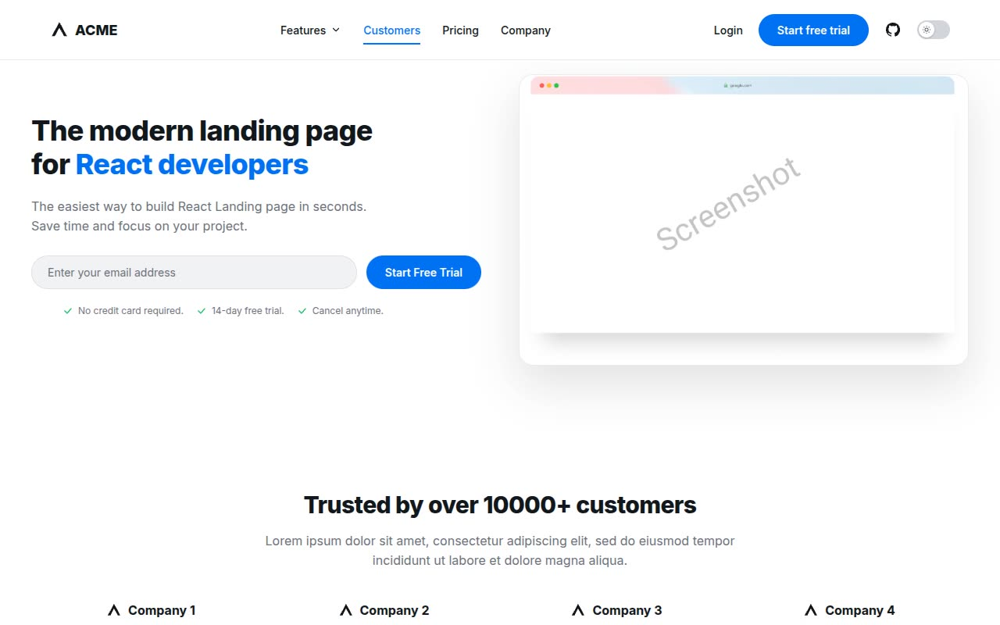

# ACME Landing — NextUI SaaS Landing Page Template (Vanilla HTML/CSS/JS)

[](./demo.mp4)

ACME Landing is a pixel-faithful clone of the open-source "landing-template-nextui" — a single-page SaaS/product marketing site originally built with Next.js and the NextUI (HeroUI) component library — rebuilt here as plain HTML, CSS, and vanilla JavaScript with no build step required. The long-scroll page covers a hero with an email-capture form and browser-chrome mockup, a "trusted by" logo cloud, three alternating feature sections (icon lists, illustrations, and a card grid), a testimonials stack, a stats strip, a four-tier pricing grid, an FAQ list, a final CTA band, and a multi-column footer. The nav includes a "Features" mega-menu dropdown, a full-screen mobile overlay menu, and a light/dark theme toggle switch driven entirely by CSS custom properties with `localStorage` persistence and a no-flash boot script. All fonts (Inter) and images (hero mockup screenshot, undraw-style illustration) are vendored locally so the site runs fully offline. Generated with Claude Fable 5.

## Run

No build step. Serve the folder with any static server:

```sh
python3 -m http.server 8080
```

Then open `http://localhost:8080/index.html` in a browser.

## Notable techniques

- **Light / dark theme tokens** — every color is a CSS custom property in `css/tokens.css`, with dark-mode overrides under `:root.dark-theme`. An inline no-flash boot script in `index.html`'s `<head>` reads `localStorage` (falling back to `prefers-color-scheme`) and applies the theme class before first paint; `js/main.js` wires the navbar toggle switch and persists the choice.
- **Features mega-menu dropdown** — clicking the "Features" nav trigger (`js/main.js`) toggles `aria-expanded` and an `.open` class on the popover panel, matching the reference's five icon+title+description items (Autoscaling, Usage Metrics, Production Ready, +99% Uptime, +Supreme Support), including the pressed-state `opacity`/`scale` transform observed on the source trigger button. Clicking outside or pressing Escape closes it.
- **Mobile full-screen nav overlay** — below the nav breakpoint, a hamburger button opens a full-screen overlay (`.mobile-overlay`) listing all nav links plus a "Legal" label, GitHub icon, Login, and Start free trial CTA, closed via the X button or by clicking any link.
- **Vendored SVG illustration** — the person-at-desk illustration is extracted directly from the reference's inline SVG markup and vendored as `assets/images/illustration.svg`, reused (mirrored via layout) across both text/illustration feature sections for pixel-accurate reproduction.
- **Hover and press states** — nav links, buttons, pricing "Get Started" CTAs, feature/testimonial cards, and footer links all carry the reference's color/transform transitions (see `css/styles.css`), verified against captured rest/hover screenshots in `.reference/home/states/`.

## Build spec and demo

`prompt.md` contains the full specification used to build this template. `demo.mp4` shows the page in motion including the hover states, theme toggle, features dropdown, and mobile menu.

## Credits

Faithful clone of an existing design, recreated for study/learning. All credit for the original design goes to its creators.

**Original:** NextUI Landing Page Template (Siumauricio) — <https://landing-template-nextui.vercel.app/>

---

Part of the [Templates](../) collection in the [fable](../../../) gallery. [Browse the live gallery](https://pulkitxm.com/claude-directory).
