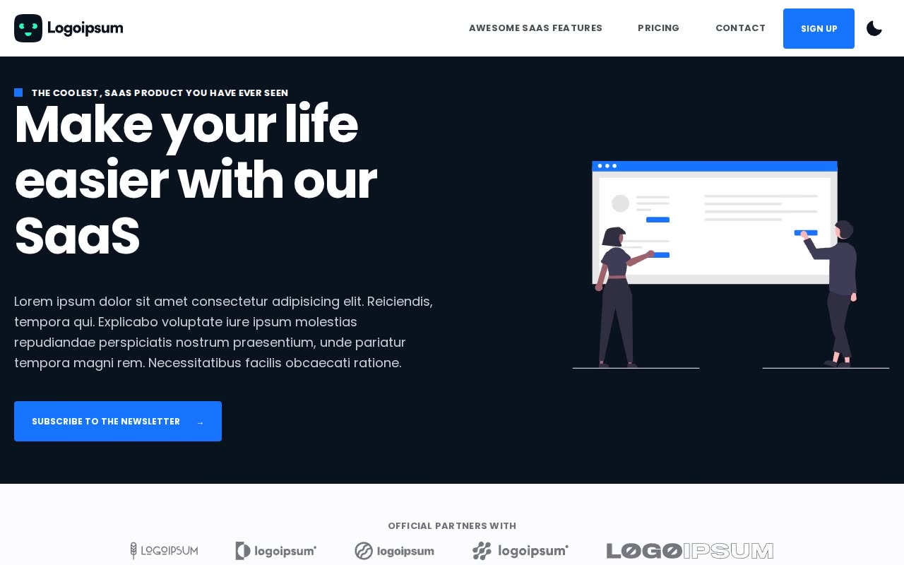

# My SaaS Startup — Next.js SaaS Starter Landing Page Clone (Vanilla HTML/CSS/JS)

[](./demo.mp4)

A pixel-faithful, self-contained clone of the official Next.js SaaS Starter marketing template — a full SaaS landing-page site with a hero, feature rows, pricing table with an animated FAQ accordion, a blog with six articles, contact form, legal pages, and a light/dark theme toggle backed by a no-flash boot script. Rebuilt as plain HTML/CSS/JS with zero build step and zero framework runtime, including every hover state, the mobile drawer, and the click-to-play YouTube facade from the source. Generated with Claude Fable 5.

## Run

No build step. Serve the folder with any static file server and open `index.html`:

```sh
python3 -m http.server 8080
# then visit http://localhost:8080/index.html
```

Or just open `index.html` directly in a browser — all assets (fonts, images, icons, the 404 illustration) are vendored locally under `assets/`, and the site works fully offline except for the optional in-page YouTube embed on `features.html` (clicking the video thumbnail loads a real `youtube.com/embed` iframe, which needs network access; the thumbnail itself is vendored).

## Pages

| Page | File |
| --- | --- |
| Home | `index.html` |
| Features | `features.html` |
| Pricing | `pricing.html` |
| Contact | `contact.html` |
| Blog index | `blog.html` |
| Blog articles | `blog-test-article.html` … `blog-test-article-6.html` |
| Privacy policy | `privacy-policy.html` |
| Cookies policy | `cookies-policy.html` |
| 404 / Sign up | `404.html`, `sign-up.html` |

`sign-up.html` mirrors `404.html` because the source's own `/sign-up` route (and its other footer placeholder links — Features2, FAQ, Help Center, etc.) resolve to the same themed not-found page; that behavior is reproduced faithfully rather than invented.

## Notes

- **Theming**: every color is driven by CSS custom properties (`--background`, `--text`, `--primary`, …) swapped via `body.next-light-theme` / `body.next-dark-theme` in `css/tokens.css`, matching the source's own token names and values. `js/theme-boot.js` runs first in `<body>` to read `localStorage.nextColorMode` (falling back to `prefers-color-scheme`) and set the theme class before paint, avoiding a flash of the wrong theme. The moon-icon button in the header (`js/site.js`) toggles and persists the theme.
- **Interactions ported from the source**: the mobile hamburger drawer (slide-in via `margin-left` with the source's exact cubic-bezier easing), the pricing page's FAQ accordion (animated `height`/chevron rotation, single-item-open), the testimonial carousel (prev/next + dots), and the click-to-load YouTube facade on the Features page all reproduce the source's observed behavior.
- `prompt.md` in this folder holds the full build spec (palette, type scale, per-page structure) this clone was built against; `demo.mp4` shows it in motion (recorded on the home page).

## Credits

Faithful clone of an existing design, recreated for study/learning. All credit for the original design goes to its creators.

**Original:** Next.js SaaS Starter (Vercel/Next.js template) — <https://next-saas-starter-ashy.vercel.app>

---

Part of the [Templates](../../../) collection in the [claude-directory](../../../../) — an open-source gallery of AI-generated UI built with Claude Fable 5. [Browse the live gallery](https://pulkitxm.com/claude-directory).
