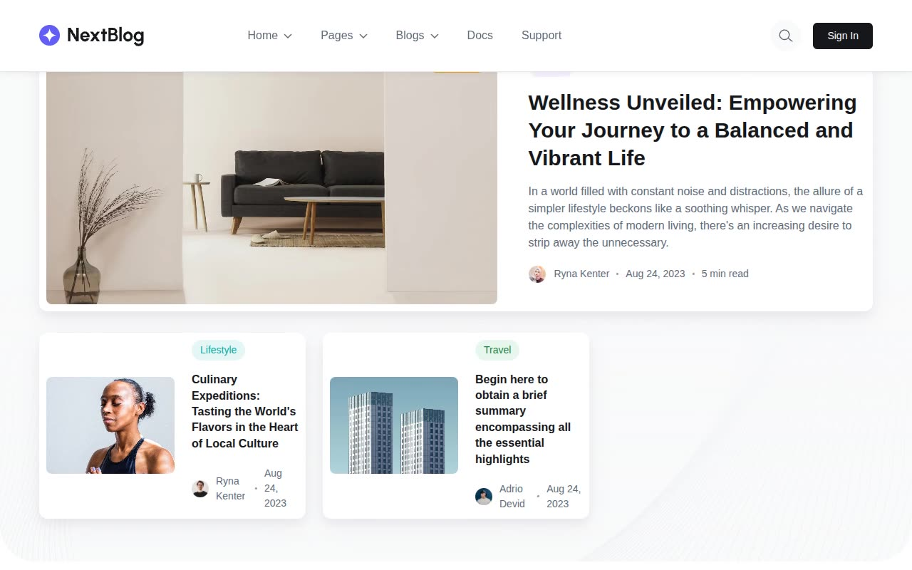

# NextBlog — Next.js Blog Template Clone

[](./demo.mp4)

A pixel-faithful HTML/CSS/JS clone of the [NextBlog premium template](https://nextblog.demo.nextjstemplates.com) by NextJS Templates. Full-featured blog platform with business and personal blog layouts, author pages, archive, search, and authentication — reproduced as a zero-dependency static site.

## Pages

| Page | File |
|------|------|
| Home (Business Blog) | `index.html` |
| Personal Blog | `personal-blog.html` |
| Blog Archive | `archive.html` |
| Blog Detail — Wellness Unveiled | `blog-details/blog-details-one.html` |
| Blog Detail — Culinary Expeditions | `blog-details/blog-details-two.html` |
| Blog Detail — Holistic Harmony | `blog-details/blog-details-three.html` |
| About Us | `about.html` |
| Author Page | `author.html` |
| Search | `search.html` |
| Privacy Policy | `privacy-policy.html` |
| Sign In | `auth/signin.html` |
| Sign Up | `auth/signup.html` |

## Features

- **Business & personal blog layouts** with hero sections, featured post cards, recent post grids, and author spotlights
- **Blog detail pages** with full article content, blockquotes, tag lists, author bio boxes, and related posts sidebar
- **Responsive navigation** with dropdown menus and mobile hamburger toggle
- **Sidebar widgets** — categories with counts, recent posts thumbnails, popular tags
- **Newsletter subscription** section with dot-pattern background
- **Auth pages** — sign in (email + Google/Facebook OAuth) and sign up with social signup
- **Search page** with popular tag chips and featured articles grid
- **Author listing** page with bio cards
- **Inter font** (self-hosted woff2) and CSS custom properties design system
- **Fully static** — no Node, no build step, open `index.html` in any browser

## Design Tokens

| Token | Value |
|-------|-------|
| Primary | `#625df5` (purple) |
| Dark | `#15171a` |
| Container max-width | `1170px` |
| Border radius | `0.5rem` |
| Font | Inter 300–800 |

## How to Run

```bash
# Serve locally
python3 -m http.server 8080
# Then open http://localhost:8080
```

Or just open `index.html` directly in a browser — all assets use relative paths.

## Reference

- **Original template**: https://nextblog.demo.nextjstemplates.com
- **Provider**: [NextJS Templates](https://nextjstemplates.com)

---

[← Templates directory](../README.md) · [← Root gallery](../../../../README.md)
