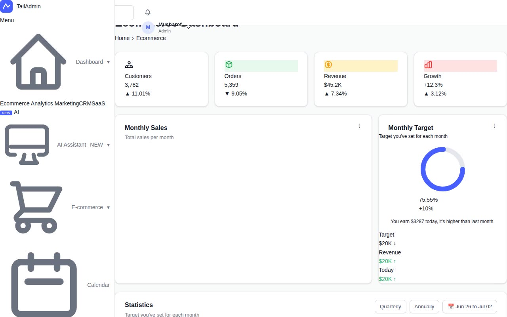

# TailAdmin Next.js Dashboard — Admin Dashboard Template Clone (Vanilla HTML + CSS + JavaScript)

[](./demo.mp4)

A pixel-faithful, same-to-same HTML/CSS/JS clone of the [TailAdmin Next.js dashboard template](https://nextjs-demo.tailadmin.com/), covering 10 fully-built pages: ecommerce dashboard, analytics, calendar, profile, data tables, form elements, chat/messages, 404 error, sign-in, and sign-up. Built with zero frameworks — plain HTML, a single CSS file (`assets/css/styles.css`), and a single JavaScript file (`assets/js/main.js`) — it reproduces the original's collapsible 290px sidebar, 64px topbar, SVG/ApexCharts bar and area charts, light/dark mode toggle (persisted to `localStorage`), responsive mobile overlay, accordion submenus, data tables, form fields, an interactive calendar, and a chat interface, all using the Outfit typeface and the `#465FFF` brand blue. Generated with Claude Fable 5.

## Pages

| File | Page |
|------|------|
| `index.html` | Ecommerce Dashboard (default) |
| `analytics.html` | Analytics |
| `calendar.html` | Calendar |
| `profile.html` | Profile |
| `tables.html` | Basic Tables |
| `forms.html` | Form Elements |
| `messages.html` | Chat / Messages |
| `404.html` | 404 Error |
| `auth/signin.html` | Sign In |
| `auth/signup.html` | Sign Up |

## Run

No build step is required. Open any page directly in a browser or serve the folder with any static file server:

```sh
# Python (built-in)
python3 -m http.server 8080
# then open http://localhost:8080
```

```sh
# Node.js (npx, no install needed)
npx serve .
```

```sh
# Or simply open index.html directly
open index.html
```

## Key Features

- **Light / dark mode** — toggled via the topbar button; theme is persisted to `localStorage` using the key `tailadmin-theme` and applied as `data-theme="dark"` on `<html>`.
- **Collapsible sidebar** — 290px wide on desktop with accordion submenus and a mobile overlay mode; collapse state is persisted to `localStorage`.
- **Charts** — bar and area charts rendered with ApexCharts (loaded from CDN).
- **Outfit font** — loaded from Google Fonts at 400/500/600/700 weights.
- **Design tokens** — brand color `#465FFF`, sidebar width `290px`, topbar height `64px`, all defined as CSS custom properties in `assets/css/styles.css`.

## Notes

`prompt.md` contains the full build specification. `demo.mp4` shows the complete template in motion.

---

## Credits

Original template: **TailAdmin Next.js** by ThemeForest / TailAdmin team — https://nextjs-demo.tailadmin.com/

This is a same-to-same HTML/CSS/JS clone built for reference and study purposes.

---

Part of the [Templates](../../README.md) collection in the [claude-directory](../../../../README.md) — an open-source gallery of AI-generated UI built with Claude Fable 5. [Browse the live gallery](https://fable.so).
