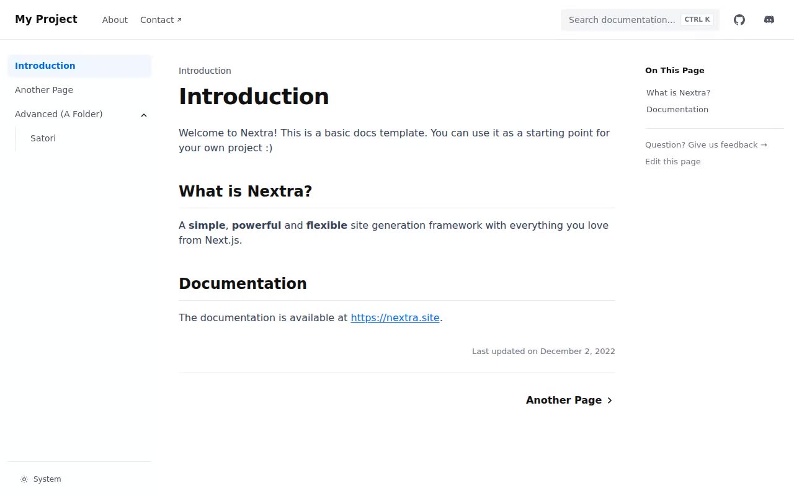

# Nextra Docs Template Clone — Docs Site Theme Study (Vanilla HTML/CSS/JS)

[](./demo.mp4)

A pixel-faithful, self-contained reproduction of the official Nextra "Docs Template" starter theme — the classic Nextra docs chrome with a sticky blurred navbar, a tree-style left sidebar with a collapsible folder, a centered MDX-style prose content column, a right "On This Page" TOC rail, and a footer with a System/Light/Dark theme switcher. Built as five static pages (Introduction, About, Another Page, Advanced, and the nested Advanced/Satori page) in plain HTML, CSS, and vanilla JavaScript with no framework or build step, including working interactions: an animated sidebar folder toggle, a client-side search modal, a persisted dark-mode switcher, and independent click-counter components on the "Another Page" example. Generated with Claude Fable 5.

## Run

This is a static site — no `package.json`, no build step, no dependencies. Serve the folder with any static file server, or open the HTML files directly in a browser:

```sh
python3 -m http.server
```

Then visit the pages:

- `index.html` — Introduction / home (`/`)
- `about.html` — About (`/about`)
- `another.html` — Another Page (`/another`), with the code block and two independent "Clicked N times" counters
- `advanced.html` — Advanced folder index (`/advanced`)
- `advanced-satori.html` — Advanced › Satori (`/advanced/satori`), the nested child page

Styling lives in `assets/css/tokens.css` (design tokens) and `assets/css/styles.css`; behavior (theme switcher, sidebar folder toggle, search modal, mobile nav, counters) lives in `assets/js/app.js`.

`prompt.md` holds the full design/content spec this clone was built against, and `demo.mp4` (with `poster.jpg`) shows it in motion.

## Credits

Faithful clone of an existing design, recreated for study/learning. All credit for the original design goes to its creators.

**Original:** Nextra Docs Template (shuding/nextra-docs-template) — <https://nextra-docs-template.vercel.app>

---

Part of the [Studies](../) collection in the [claude-directory](../../) — an open-source gallery of AI-generated UI built with Claude Fable 5. [Browse the live gallery](https://pulkitxm.com/claude-directory).
