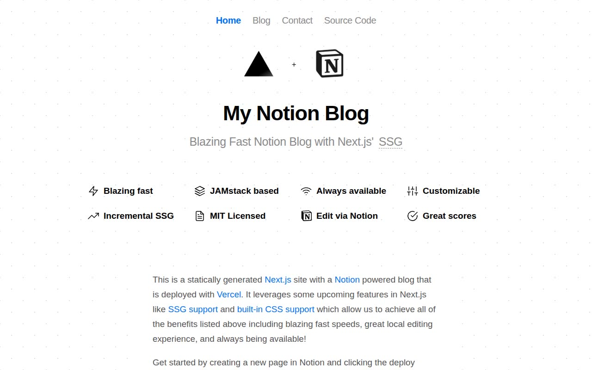

# My Notion Blog — Notion-Powered Blog Template Clone (Vanilla HTML/CSS/JS)

[](./demo.mp4)

A pixel-faithful static recreation of the Notion-powered blog template originally built by Vercel engineer JJ Kasper. The clone reproduces all three pages — home, blog listing, and contact — with their exact layout, typography, design tokens, and Vercel Geist-inspired visual style. Key details faithfully reproduced include the fixed radial-gradient polka-dot background, the eight-feature icon grid, the centered nav with active-link highlighting in Vercel blue (`#0070f3`), and the Vercel deploy-button footer. The implementation uses no build tools or frameworks: plain HTML, CSS with CSS custom properties, and inline SVG icons. Generated with Claude Fable 5.

## Pages

| File | Route equivalent |
|---|---|
| `index.html` | `/` — Home / feature overview |
| `blog.html` | `/blog` — Blog post listing |
| `contact.html` | `/contact` — Author contact page |

Shared styles live in `styles.css`. Static assets (logos, avatar, deploy button) are in `assets/images/`.

## Run

No build step required. Open any page directly in a browser:

```sh
open index.html
```

Or serve the folder with a local static server so inter-page links resolve correctly:

```sh
python3 -m http.server
# then open http://localhost:8000
```

## Design notes

- **Background**: a double-layer `radial-gradient` dot pattern at a 50 px grid with `background-attachment: fixed`, matching the original exactly.
- **Dark mode**: CSS custom properties switch via `@media (prefers-color-scheme: dark)` and a `data-theme` attribute; a no-flash `<script>` in `<head>` reads `localStorage` to apply the stored preference before first paint.
- **Type scale**: system sans-serif stack at 20 px base; H1 at 2.25 rem / 800 weight with −0.05 rem letter-spacing; H2 at 1.25 rem / 300 weight.
- **Colour palette**: Vercel blue `#0070f3` for active nav links and CTAs; `#3291ff` on hover; muted greys via `--accents-1` through `--accents-3`.

`prompt.md` contains the full build specification. `demo.mp4` shows the finished result in motion.

## Credits

Faithful clone of an existing design, recreated for study/learning. All credit for the original design goes to its creators.

**Original:** Vercel / ijjk (JJ Kasper) — <https://notion-blog.vercel.app/>

---

Part of the [Templates](../../) collection — specifically the [Vercel](../) provider group — in the [claude-directory](../../../) — an open-source gallery of AI-generated UI built with Claude Fable 5. [Browse the live gallery](https://pulkitxm.com/claude-directory).
