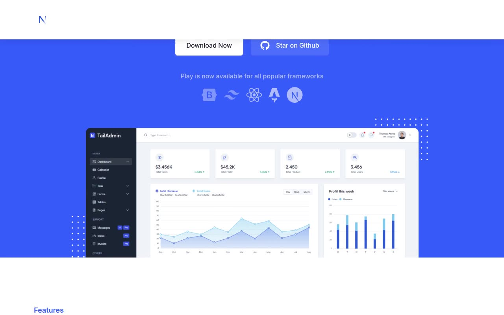

# Play — Next.js SaaS Landing Page Template Clone (Vanilla HTML/CSS/JS)

[](./demo.mp4)

Play is a pixel-faithful, self-contained clone of the "Play" Next.js SaaS starter kit and boilerplate marketing template by GrayGrids / Next.js Templates, rebuilt as plain HTML, CSS, and vanilla JavaScript with no build step required. The multi-page site reproduces every section of the original — long-form home page, About, Pricing, Contact, Blog grid, three blog detail pages, Sign In, Sign Up, and a 404-style Error page — along with the full design system: primary blue (`#3758F9`) on dark navy, Inter typeface, light/dark theme toggle persisted via a `dark` class on `<html>`, sticky header scroll transition, dropdown navigation, mobile hamburger menu, FAQ accordion, and scroll-reveal entrance animations, all running offline with locally vendored fonts and images. Generated with Claude Fable 5.

## Pages

| Page | File |
|---|---|
| Home | `index.html` |
| About | `about.html` |
| Pricing | `pricing.html` |
| Contact | `contact.html` |
| Blog grid | `blogs.html` |
| Blog — MDX example | `blogs/blog-example-with-mdx-file.html` |
| Blog — Bootstrap templates | `blogs/bootstrap-templates.html` |
| Blog — Contact form | `blogs/contact-form.html` |
| Sign In | `signin.html` |
| Sign Up | `signup.html` |
| Error (404) | `error.html` |

## Features

- **Light / dark mode** — moon/sun toggle in the header; preference persisted and applied via a `dark` class on `<html>` with a no-flash boot script honouring `prefers-color-scheme` on first paint.
- **Sticky header** — transparent over the hero, transitions to a solid background with shadow on scroll (~300 ms ease).
- **Dropdown navigation** — "Pages" nav item reveals a fly-out list of all inner pages; slides/fades open with CSS transitions.
- **Mobile menu** — hamburger icon toggles a full-width nav drawer; closes on link click or outside tap.
- **FAQ accordion** — six items expand/collapse with animated height and a rotating chevron icon (~300 ms ease).
- **3-tier pricing cards** — Basic / Premium / Business tiers; the Premium card is visually highlighted with a deeper shadow and distinct styling.
- **Testimonials** — three cards with star ratings and avatar images.
- **Team grid** — four cards with circular photos and social icon links.
- **Blog preview + detail** — three-card blog grid on the home page and blogs index; three individual article pages with cover images, metadata, and prose content.
- **Contact form** — split-layout band with location/support info alongside a name/email/phone/message form.
- **Scroll-reveal animations** — entrance animations on section content as the user scrolls.
- **Fully offline** — all fonts, images, and icons are vendored locally; no CDN dependency at runtime.

## Run

No build step is required. Open any page directly in a browser:

```sh
open index.html
```

Or serve the folder over HTTP (recommended, ensures correct relative paths for the blog sub-pages):

```sh
python3 -m http.server 8080
# then open http://localhost:8080
```

Any static file server works (e.g. `npx serve .`, VS Code Live Server, Nginx).

## Reference

`prompt.md` holds the full build specification. `demo.mp4` (with `poster.jpg` thumbnail) shows the template in motion across all pages and interactive states.

## Credits

Faithful clone of an existing design, recreated for study/learning. All credit for the original design goes to its creators.

**Original:** NextJS Templates — https://play.demo.nextjstemplates.com

---

Part of the [Templates](../) collection in the [claude-directory](../../) — an open-source gallery of AI-generated UI built with Claude Fable 5. [Browse the live gallery](https://pulkitxm.com/claude-directory).
