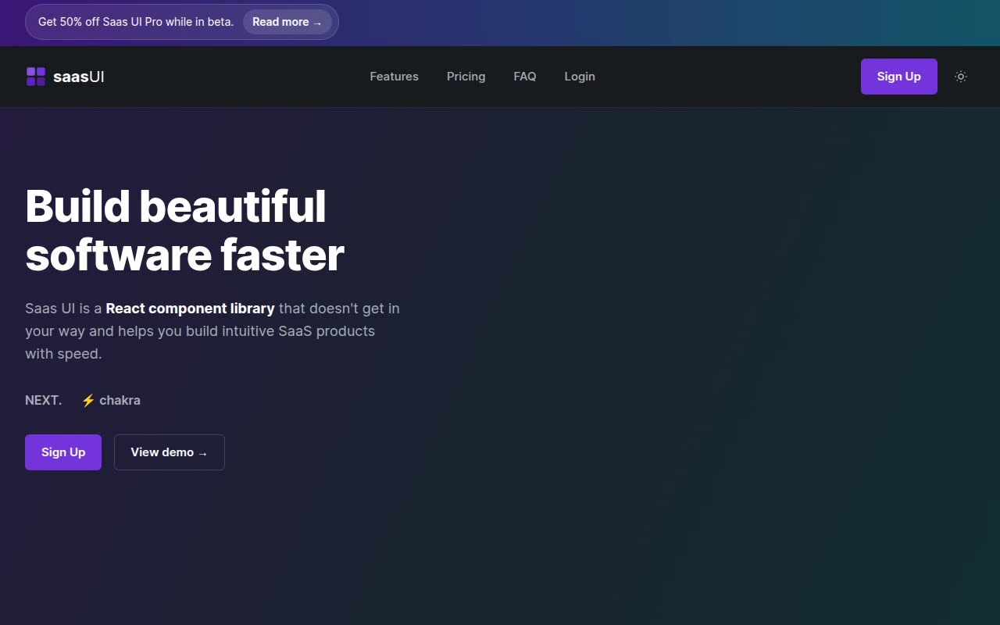

# Saas UI — SaaS Component Library Landing Page Clone (HTML + CSS + Vanilla JS)

[](./demo.mp4)

A pixel-faithful, self-contained clone of the Saas UI Next.js landing page — a dark-by-default (light-mode capable) SaaS marketing site for a React/Chakra UI component library, featuring a hero with a dashboard mockup, feature grids, pricing tiers, testimonials, an FAQ, and dedicated login/signup pages. Rebuilt as plain HTML, CSS, and vanilla JavaScript with no build step, no frameworks, and a working light/dark theme toggle plus a mobile hamburger menu. Generated with Claude Fable 5.

## Run

No build step required — just serve the folder statically and open it in a browser:

```sh
python3 -m http.server 8000
# then open http://localhost:8000/index.html
```

Or simply open `index.html` directly in a browser.

Pages in this clone:

- `index.html` — home page (hero, features, pricing, FAQ)
- `login.html` — login page
- `signup.html` — signup page

## Notes

- **Theme toggle** (`aria-label="theme toggle"`, top-right of the header) flips the whole page between dark and light instantly via a `data-theme` attribute on `<html>` and CSS custom properties in `css/tokens.css`. The choice persists in `localStorage` and a no-flash boot script (`js/theme-boot.js`) applies it before first paint.
- **Mobile menu** (`aria-label="Open menu"`, visible under the nav-link breakpoint) slides open a full-width dropdown with all nav links and the Sign Up button, handled in `js/script.js`.
- **Copy-to-clipboard** on the `yarn add @saas-ui/react` code chip, and a subtle load-in reveal animation on the hero content, are also implemented in `js/script.js`.
- All fonts (Inter variable), images (avatars, dashboard mockup screenshot), and icons are vendored locally under `assets/` — the clone runs fully offline.
- `prompt.md` holds the full build spec (style tokens, palette, layout breakdown per page) and `demo.mp4` shows it in motion.

## Credits

Faithful clone of an existing design, recreated for study/learning. All credit for the original design goes to its creators.

**Original:** Saas UI (Eelco Wiersma) — <https://saas-ui-nextjs-landing-page.netlify.app>

---

Part of the [Templates](../../../) collection in the [claude-directory](../../../../) — an open-source gallery of AI-generated UI built with Claude Fable 5. [Browse the live gallery](https://pulkitxm.com/claude-directory).
