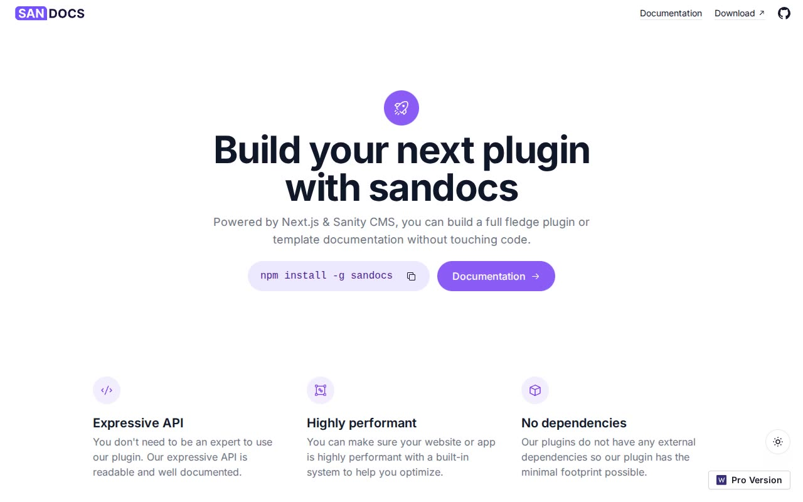

# Sandocs — Documentation Site Template (Vanilla HTML/CSS/JS)

[](./demo.mp4)

A faithful, self-contained clone of Sandocs, a Next.js + Tailwind CSS documentation-site template by Web3Templates, rebuilt as plain HTML/CSS/JS with no build step. It reproduces the marketing landing page and all 20 docs pages (Getting Started, Configuration, Plugins, API Reference) with a sticky left sidebar nav, a scroll-spy "On This Page" table of contents, a copy-to-clipboard CLI install snippet, hover-lift feature cards, a mobile hamburger drawer, and a light/dark theme toggle with `localStorage` persistence and a no-flash boot script. Generated with Claude Fable 5.

## Pages

- `index.html` — landing page: hero with CLI install snippet, feature rows, code-window mockup, sponsor logos, footer
- `docs/index.html` plus 20 docs pages under:
  - `docs/getting-started/` — intro, prerequisites, environment, installation, browsers
  - `docs/configuration/` — typography, asset-handling, cli, accessibility, typescript, rendering, lifecycle
  - `docs/plugins/` — write-plugin, plugin-configuration
  - `docs/api/` — http-api, app-directive, endpoints, server, client, dom

Each docs page shares the same shell: a sticky, scrollable left sidebar nav (active item highlighted), a center content column (markdown-style body with prev/next footer nav), and a sticky right rail with a scroll-spy "On This Page" TOC.

## Run

This is plain HTML/CSS/JS with no build step and no dependencies to install. Serve it with any static file server from the project folder:

```sh
python3 -m http.server 5199
# then open http://localhost:5199/index.html
```

Or open `index.html` directly in a browser.

## Key Features

- Light/dark theme toggle backed by `data-theme` + `localStorage`, with a no-flash boot script that applies the saved theme before first paint
- Sticky sidebar navigation across all docs pages, grouped into Getting Started, Configuration, Plugins, and API Reference
- Sticky "On This Page" TOC with scroll-spy highlighting of the active heading as you scroll
- Copy-to-clipboard button on the home-page CLI install snippet (`npm install -g sandocs`)
- Mobile hamburger drawer for the sidebar nav on small screens
- Hover-lift feature cards on the landing page
- Styling split across `assets/css/tokens.css` (design tokens), `assets/css/site.css` (layout/components), and vendored Tailwind utilities in `assets/css/vendor-tailwind.css`, with behavior in `assets/js/site.js`

`prompt.md` holds the full build spec (style, layout, and interaction details captured from the original site). `demo.mp4` shows the template in motion.

## Credits

Faithful clone of an existing design, recreated for study/learning. All credit for the original design goes to its creators.

**Original:** Sandocs (Web3Templates) — <https://sandocs.vercel.app>

---

Part of the [Web3Templates](../) collection in the [Templates](../../../) — an open-source gallery of UI. [Browse the live gallery](https://pulkitxm.com/claude-directory).
