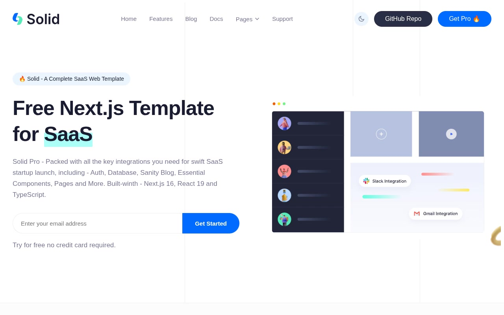

# Solid — Multi-Page SaaS Website Template Clone (Vanilla HTML/CSS/JS + Swiper.js)

[](./demo.mp4)

Solid is a pixel-faithful reproduction of the Next.js Templates "Solid" SaaS boilerplate, rebuilt as self-contained plain HTML, CSS, and vanilla JavaScript with no build step required. The template spans eight fully linked pages — home, blog listing, blog detail, docs, sign-in, sign-up, support, and 404 — covering every section a SaaS marketing site needs: animated background lines, sticky header with dark/light mode toggle, hero section with dashboard preview image, brand logo strip, features grid, three-tier pricing table, Swiper.js testimonials carousel, newsletter footer, and a sidebar-driven documentation layout. Design tokens use the Inter font family, a `#006BFF` primary blue, and `#181C31` dark backgrounds with smooth CSS transitions throughout. Generated with Claude Fable 5.

## Run

No build step is needed. Open any page directly in a browser, or serve with a static file server for correct relative links:

```sh
# Option 1 — open directly
open index.html

# Option 2 — Python static server (recommended)
python3 -m http.server 8080
# then visit http://localhost:8080
```

## Pages

| File | Page |
|---|---|
| `index.html` | Home — hero, features grid, pricing table, testimonials, footer |
| `blog.html` | Blog listing — 6-card grid |
| `blog-details.html` | Blog article with search/categories sidebar |
| `docs.html` | Documentation with sidebar navigation |
| `auth-signin.html` | Sign-in form |
| `auth-signup.html` | Sign-up / registration form |
| `support.html` | Contact / support form with location card |
| `error.html` | 404 error page |

## Notable techniques

- **No-flash dark mode** — an inline `<script>` runs before first paint to read `localStorage` and apply the `dark` or `light` class to `<html>`, eliminating theme flash on reload. Theme is persisted to `localStorage` and respects `prefers-color-scheme` on first visit.
- **Scroll reveal** — `IntersectionObserver` adds an `is-visible` class to `.animate-reveal` elements as they enter the viewport.
- **Testimonials carousel** — driven by [Swiper.js v11](https://swiperjs.com/) loaded from jsDelivr CDN; no local dependency needed.
- **Animated background lines** — three `<span>` elements inside `.bg-lines` animate at 3 s, 6 s, and 9 s intervals via CSS `@keyframes`.
- **All assets vendored locally** — fonts and images live under `assets/` so the template works fully offline after cloning.

`prompt.md` holds the full build spec and design token reference; `demo.mp4` shows the template in motion.

## Credits

Faithful clone of an existing design, recreated for study/learning. All credit for the original design goes to its creators.

**Original:** Next.js Templates — <https://solid.demo.nextjstemplates.com/>

---

Part of the [Templates](../../../) collection in the [claude-directory](../../../../) — an open-source gallery of AI-generated UI built with Claude Fable 5. [Browse the live gallery](https://pulkitxm.com/claude-directory).
