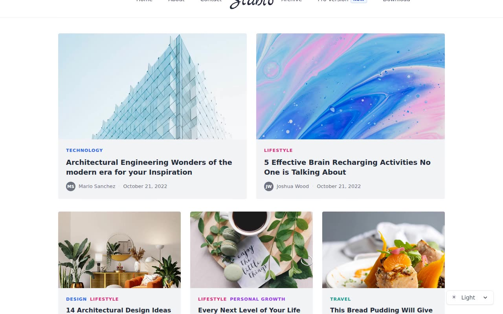

# Stablo Blog Template Clone — Minimal Blog Website (Vanilla HTML/CSS/JS)

[](./demo.mp4)

Pixel-faithful clone of the Stablo minimal blog template by Web3Templates, reproduced as a self-contained plain HTML/CSS/JS project with no build step required. The design is typography-forward with Inter as the body font, a centered SVG script-wordmark logo, category-colored post labels, and image hover-scale transitions. It covers all five key page types from the original: home, about, contact, archive, and a sample blog post. Built with Vanilla HTML, CSS, and JavaScript. Generated with Claude Fable 5.

## Features

- Typography-first minimal blog layout with a centered max-width container
- Home page with a 2-column featured post grid and a 3-column secondary post grid (14 posts total)
- Category-colored labels: Technology (blue), Lifestyle (pink), Travel (teal), Design (blue), Personal Growth (purple)
- Hover scale transition on all post card images (scale 1.05, 300ms)
- Responsive navigation with a hamburger-toggled mobile dropdown
- Light / Dark / System theme toggle with no-flash initialization via `localStorage`
- Dual SVG logos (light and dark variants) that swap with the active theme
- Author avatar, name, date, and read time on every post card and post page
- Author bio card at the bottom of each post page

## Pages

| File | Route | Description |
|---|---|---|
| `index.html` | `/` | Home — featured 2-up + 3-column post grid |
| `about.html` | `/about` | About — team photo grid + centered body copy |
| `contact.html` | `/contact` | Contact — info columns + contact form |
| `archive.html` | `/archive` | Archive — full 3-column post grid with pagination |
| `post.html` | `/post/...` | Single post — full-width image, article body, author bio |

## Run

No build step required. Open `index.html` directly in a browser, or serve the folder with a static server:

```sh
python3 -m http.server
```

Then visit `http://localhost:8000` in your browser.

## Theme Support

The theme toggle select (bottom-right corner of every page) offers three modes:

- **Light** — white background, gray-800 text
- **Dark** — black background, gray-400 text, gray-800 card backgrounds
- **System** — follows the OS `prefers-color-scheme` media query automatically

The selected theme is persisted to `localStorage` under the key `stablo-theme`. A no-flash inline script at the top of `<head>` applies the saved theme before first paint.

## Assets

All assets live in the `assets/` folder:

- `logo-light.svg` / `logo-dark.svg` — SVG script wordmark, swapped by theme
- `post1.png` … `post14.png/.jpg` — post card and featured images
- `team1.jpg` … `team3.jpg` — about page team photos

The full build spec is in `prompt.md` and the template in motion is shown in `demo.mp4`.

## Credits

Faithful clone of an existing design, recreated for study/learning. All credit for the original design goes to its creators.

**Original:** Web3Templates — https://stablo.web3templates.com

---

Part of the [Templates](../../) collection in the [claude-directory](../../../../) — an open-source gallery of AI-generated UI built with Claude Fable 5. [Browse the live gallery](https://pulkitxm.com/claude-directory).
