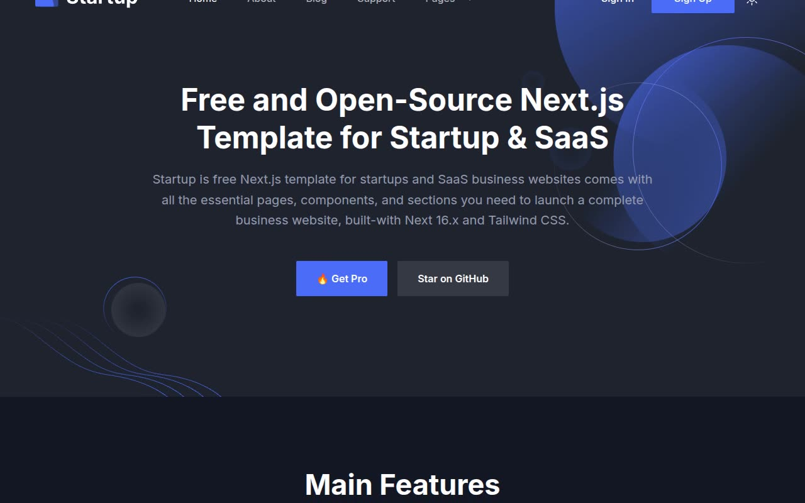

# Startup — SaaS & Business Landing Page Template Clone (Vanilla HTML/CSS/JS)

[](./demo.mp4)

A self-contained, pixel-faithful reproduction of the **Startup** open-source Next.js + Tailwind CSS template, rebuilt as plain HTML, CSS, and vanilla JavaScript with **no build step**. It's a dark-by-default (light-mode toggleable) marketing site for startups, SaaS, and business sites, featuring a hero with decorative blurred spheres and wire-polygon shapes, a 6-card features grid, a video/image feature block, a monthly/yearly pricing switch, testimonials, blog previews, and a shared sticky/transparent header with mobile hamburger menu and "Pages" dropdown — across 9 full pages. All assets (Inter variable fonts, images, icons) are vendored locally so the site runs completely offline. Generated with Claude Fable 5.

## Pages

Nine static HTML pages share the same header, footer, theme toggle, and mobile nav:

- `index.html` — Home: hero (headline, CTAs, decorative shapes), brand logo strip, "Main Features" 6-card grid, video/image feature block, "Crafted for Startup, SaaS and Business Sites" split section, 3-row feature highlights, testimonial grid, monthly/yearly pricing toggle with 3 pricing cards, blog preview grid, contact/newsletter CTA panels.
- `about.html` — Breadcrumb header, "Crafted for..." split section, image + 3-row feature list.
- `blog.html` — Blog Grid: 3-column blog card grid with category pills and numbered pagination.
- `blog-details.html` — Article header, cover image, rich-text body, popular tags, share-icon row.
- `blog-sidebar.html` — Same article body plus a sidebar (search, related posts, popular category/tags, newsletter card).
- `contact.html` — Support-ticket form panel and newsletter subscribe panel.
- `signin.html` — Centered sign-in card with OAuth buttons, email/password fields, "Keep me signed in" checkbox.
- `signup.html` — Centered sign-up card with OAuth buttons, name/email/password fields, terms checkbox.
- `error.html` — 404 page with decorative "404" numeral art and "Back to Homepage" button.

## Interactions

All behavior is in `app.js` (no framework, no bundler):

- **Light/dark theme toggle** — sun/moon button flips the root `dark` class and persists the choice to `localStorage.theme`; an inline no-flash boot script applies the saved (or `prefers-color-scheme`) theme before first paint so there's no light/dark flicker on load.
- **Sticky/transparent header** — header is absolutely positioned and transparent over the home hero, then swaps to a sticky, opaque, shadowed bar once the page scrolls.
- **Mobile hamburger menu** — a 3-bar toggler animates into an "X" and opens the collapsed mobile nav panel below the `lg` breakpoint; includes the "Pages" dropdown (Blog Grid / Blog Details / Blog Sidebar / Sign In / Sign Up / Error).
- **Pricing monthly/yearly switch** — a sliding-knob toggle on the home page swaps every plan's price and highlights the active period label.
- **Form feedback** — sign-in/sign-up/contact/newsletter forms show inline feedback on submit with no backend.

## Run

There is no build step or dependencies. Serve the folder over a static HTTP server, then open the site in a browser:

```sh
python3 -m http.server 8000
# then open http://localhost:8000/
```

Any static file server works (for example `npx serve`). The full build spec lives in `prompt.md`, and `demo.mp4` (poster: `poster.jpg`) shows all 9 pages and their interactions in motion.

## Credits

Faithful clone of an existing design, recreated for study/learning. All credit for the original design goes to its creators.

**Original:** NextJSTemplates / Uideck — <https://startup.demo.nextjstemplates.com>

---

Part of the [Templates](../../../) collection in the [claude-directory](../../../../) — an open-source gallery of AI-generated UI built with Claude Fable 5. [Browse the live gallery](https://pulkitxm.com/claude-directory).
