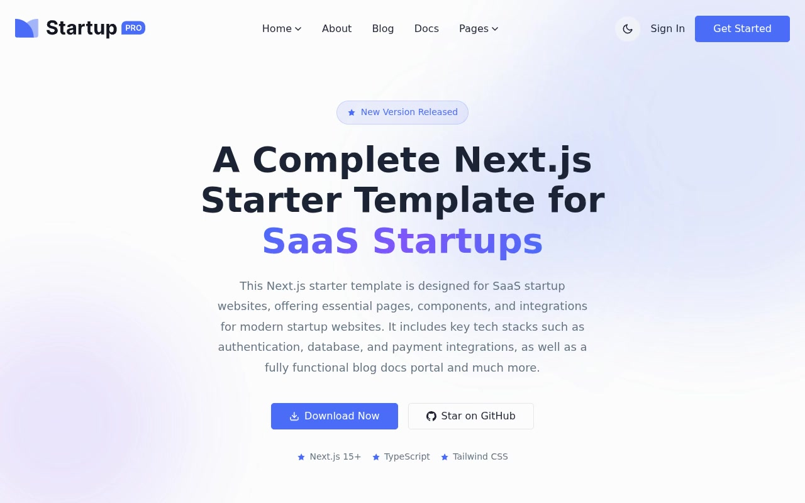

# Startup Pro — SaaS Startup Landing Page Template Clone (Vanilla HTML + CSS + JS)

[](./demo.mp4)

Pixel-faithful static reproduction of the Startup Pro premium SaaS landing page template, rebuilt as plain HTML, CSS, and vanilla JavaScript with no build step and all assets vendored locally. The design is clean and professional, centered on a vivid blue (`#4A6CF7`) accent against white in light mode and deep navy (`#040A22`) in dark mode, using a self-hosted Inter variable-weight typeface. Standout features include a persistent dark/light mode toggle (CSS custom properties + `localStorage`), a sticky header with dropdown navigation, two distinct homepage variants, scroll-reveal animations via AOS, a FAQ accordion, three-tier pricing cards, a full blog system (grid layout, list layout, and a detail page), a contact form, and animated hero gradient shapes — making it a practical reference for modern SaaS marketing-site patterns. Generated with Claude Fable 5.

## Pages

| File | Route equivalent |
|---|---|
| `index.html` | Home (variant 1) |
| `home-2.html` | Home (variant 2) |
| `about.html` | About |
| `blogs.html` | Blog grid |
| `blogs-2.html` | Blog list |
| `blog-detail.html` | Blog article |
| `pricing.html` | Pricing |
| `faq.html` | FAQ |
| `contact.html` | Contact |

## Run

No build step is required. Serve the project root with any static file server, for example:

```sh
python3 -m http.server 8080
```

Then open `http://localhost:8080` in your browser. Alternatively, open `index.html` directly in a browser (note that some browsers restrict `localStorage` on `file://` origins, so a local server is recommended for the theme toggle to persist correctly).

## Notes

**Dark/light mode** is driven entirely by CSS custom properties. A no-flash inline script at the top of each page reads `localStorage` and sets the `.dark` class on `<html>` before paint. The theme toggle button swaps the class and writes back to `localStorage`.

**AOS (Animate On Scroll)** controls `fade-up`, `fade-right`, and `fade-left` entrance animations throughout the page. Its script and stylesheet are loaded inline from each HTML file.

**All assets** — images, font files, and vendor scripts — are vendored locally under the `assets/` directory so the project runs fully offline.

`prompt.md` holds the full build specification and `demo.mp4` shows the result in motion.

## Credits

Faithful clone of an existing design, recreated for study/learning. All credit for the original design goes to its creators.

**Original:** Next.js Templates — <https://startup-pro.demo.nextjstemplates.com/>

---

Part of the [Templates](../../../) collection in the [claude-directory](../../../../) — an open-source gallery of AI-generated UI built with Claude Fable 5. [Browse the live gallery](https://pulkitxm.com/claude-directory).
