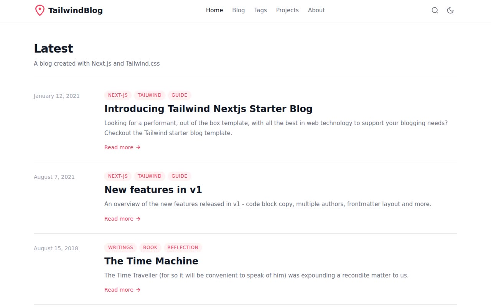

# Tailwind Next.js Starter Blog — Multi-Page Blog Template Clone (Vanilla HTML/CSS/JS)

[](./demo.mp4)

A pixel-faithful, self-contained static clone of the [Tailwind Next.js Starter Blog](https://tailwind-nextjs-starter-blog.vercel.app) by Timothy Lin (timlrx), reproduced as plain HTML, CSS, and vanilla JavaScript with no build step required. The clone covers the full multi-page structure — home, blog listing, tag archive, projects showcase, about page, five individual blog posts, and ten tag pages — all sharing a consistent chrome with Space Grotesk typography, a rose/pink accent palette, and a no-flash light/dark mode toggle persisted to `localStorage`. Built with Vanilla HTML/CSS/JS. Generated with Claude Fable 5.

## Run

No build step is needed. Open `index.html` directly in a browser:

```sh
open index.html
```

Or serve the folder with any static file server, for example:

```sh
python3 -m http.server
```

Then visit `http://localhost:8000`.

## Pages

| File | Description |
|---|---|
| `index.html` | Home — hero section and 5 most-recent posts |
| `blog.html` | Full blog listing with tag sidebar and search field |
| `tags.html` | All-tags grid with post-count badges |
| `projects.html` | Projects showcase with 2 project cards |
| `about.html` | Author bio for "Tails Azimuth" with social links |
| `blog/*.html` | 5 individual blog post pages |
| `tags/*.html` | 10 individual tag archive pages |

## Features

- **Space Grotesk font** loaded from Google Fonts (weights 400/500/600/700)
- **Rose/pink primary palette** matching the original (`#E11D48` light, `#FB7185` dark)
- **Light/dark mode** — no-flash inline boot script, `localStorage` persistence, sun/moon toggle
- **Mobile-responsive layout** with hamburger menu full-screen overlay
- **Scroll-to-top button** on long pages
- **Blog post layout** with left author sidebar and right tags/navigation sidebar
- **Search field** on the blog listing page (client-side filtering)
- **Code block copy buttons** on all post pages
- **Tag-based navigation** — sidebar tag list with post counts, dedicated tag archive pages
- **Pill-shaped tags**, smooth hover transitions, and `scroll-smooth` behavior throughout

## Credits

Faithful clone of an existing design, recreated for study/learning. All credit for the original design goes to its creators.

**Original:** timlrx / Tailwind Next.js Starter Blog — https://tailwind-nextjs-starter-blog.vercel.app

---

`prompt.md` holds the full build specification. `demo.mp4` shows the clone in motion.

---

Part of the [Templates](../) collection in the [claude-directory](../../../) — an open-source gallery of AI-generated UI built with Claude Fable 5. [Browse the live gallery](https://pulkitxm.com/claude-directory).
