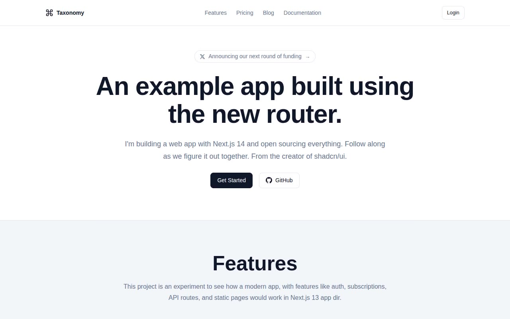

# Taxonomy — shadcn Demo App Clone (Vanilla HTML/CSS/JS)

[](./demo.mp4)

Pixel-faithful, no-build reproduction of [Taxonomy](https://tx.shadcn.com), the official shadcn demo app originally built to showcase Next.js 13 App Router, Server Components, authentication, and subscriptions. This clone rebuilds all 12 pages as plain HTML, CSS, and vanilla JS — no framework, no bundler, no build step — while preserving the full design system: the minimal black-and-white palette driven by HSL CSS variables, CalSans-SemiBold display headings, Inter body text, dark/light theme toggle with system-preference detection, responsive mobile layout with hamburger menu, and clean border-based card aesthetics. Generated with Claude Fable 5.

## Pages

| File | Route |
|------|-------|
| `index.html` | `/` — Marketing home |
| `blog.html` | `/blog` — Blog index |
| `blog-server-client-components.html` | `/blog/server-client-components` — Blog post |
| `pricing.html` | `/pricing` — Pricing |
| `guides.html` | `/guides` — Guides index |
| `docs.html` | `/docs` — Docs introduction |
| `docs-documentation.html` | `/docs/documentation` — Docs overview |
| `docs-documentation-components.html` | `/docs/documentation/components` — Components |
| `docs-documentation-code-blocks.html` | `/docs/documentation/code-blocks` — Code blocks |
| `docs-documentation-style-guide.html` | `/docs/documentation/style-guide` — Style guide |
| `login.html` | `/login` — Login |
| `register.html` | `/register` — Register |

## Run

No build step required. Open directly in a browser:

```
open index.html
```

Or serve locally with Python for correct MIME types and font loading:

```sh
python3 -m http.server 8080
# then visit http://localhost:8080
```

## Design system notes

- **Theme toggle** — detects `prefers-color-scheme` on first load; manual toggle persists in `localStorage`. All colors are expressed as HSL CSS custom properties on `:root` and `[data-theme="dark"]`.
- **Fonts** — `CalSans-SemiBold` is vendored at `assets/fonts/CalSans-SemiBold.woff2` and loaded via `@font-face` in `styles.css`, so the site works offline. Inter is loaded from Google Fonts.
- **Shared styles** — `styles.css` contains the full design system: color variables, typography scale, layout primitives, component classes, and dark-mode overrides.

See `prompt.md` for the full build specification and `demo.mp4` for a walkthrough of every page in motion.

## Credits

Faithful clone of an existing design, recreated for study/learning. All credit for the original design goes to its creators.

**Original:** shadcn/ui Taxonomy — <https://tx.shadcn.com>

---

Part of the [Templates](../) collection in the [claude-directory](../../) — an open-source gallery of AI-generated UI built with Claude Fable 5. [Browse the live gallery](https://pulkitxm.com/claude-directory).
