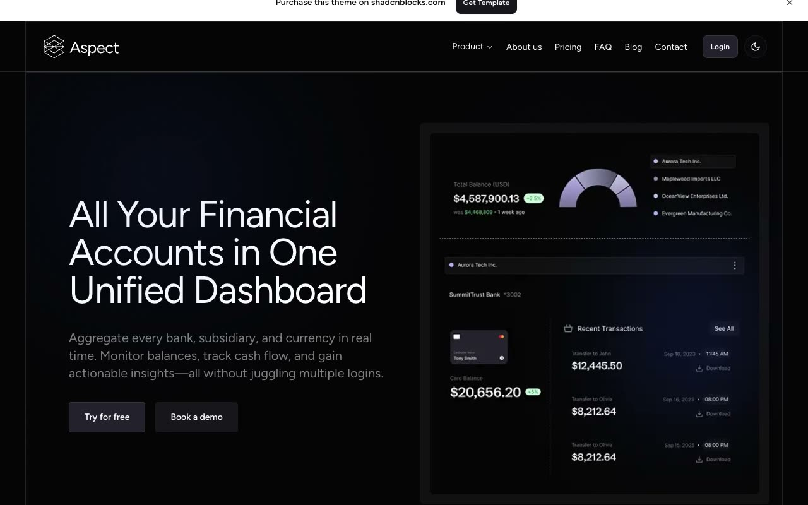

# Aspect — Fintech SaaS Marketing Website Template Clone (Vanilla HTML/CSS/JS)

[](./demo.mp4)

A pixel-faithful, self-contained clone of the premium **Aspect** shadcn/ui template — a dark-first fintech / financial SaaS marketing site — rebuilt as plain HTML, CSS, and vanilla JavaScript with no build step. The 17-page site reproduces the full chrome and interactions same-to-same: a light/dark theme toggle (persisted, honors `prefers-color-scheme`), a product mega-menu dropdown, a mobile nav drawer, a dismissible announcement banner, FAQ accordions, a monthly/annual pricing billing toggle, a logo marquee, and tabbed feature showcases — across home, features, pricing, about, blog, FAQ, contact, login, signup, and long-form legal pages. The design uses near-black obsidian surfaces, hairline white-alpha borders, a centered max-width container with persistent left/right border rules, the Figtree typeface, and a violet "star" accent driven by HSL custom-property tokens. Generated with Claude Fable 5.

## Run

This project is fully static — no install or build step. Serve the folder and open `index.html`:

```sh
python3 -m http.server
```

Then open <http://localhost:8000> in your browser. The theme toggle, accordions, pricing toggle, mega-menu, and feature tabs are all wired up in `app.js`; styles live in `styles.css`.

## Notes

- Theme: `app.js` toggles the `.dark` class on `<html>` and persists the choice in `localStorage`; boot defaults to dark and honors the system color scheme without a flash.
- Interactions in vanilla JS: banner dismiss, radix-style FAQ accordions, product mega-menu, mobile drawer, monthly↔annual pricing toggle, logo marquee, and feature tabs.
- `prompt.md` holds the full build spec (palette tokens, typography, layout traits, page list); `demo.mp4` shows the site in motion.

## Credits

Faithful clone of an existing design, recreated for study/learning. All credit for the original design goes to its creators.

**Original:** Aspect — a premium shadcn/ui template by shadcnblocks.com — <https://www.shadcnblocks.com/template/aspect>

---

Part of the [Templates](../../../README.md) collection in the [claude-directory](../../../../README.md) — an open-source gallery of AI-generated UI built with Claude Fable 5. [Browse the live gallery](https://pulkitxm.com/claude-directory).
