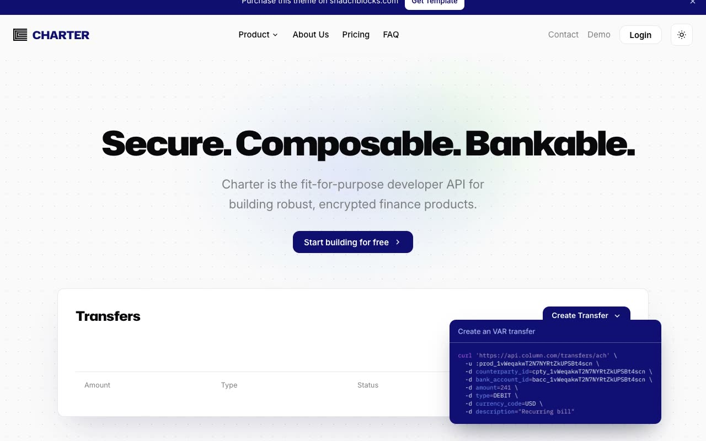

# Charter — Fintech / Developer-API Marketing Template Clone (Vanilla HTML/CSS/JS)

[](./demo.mp4)

Charter is a faithful, same-to-same clone of the premium "Charter" fintech / developer-API marketing template from shadcnblocks, rebuilt as a self-contained static site in plain HTML, CSS, and vanilla JavaScript with no build step. It ships a full 9-page marketing site (home, about, pricing, FAQ, contact / book a demo, login, signup, terms, privacy) with light and dark mode, a dismissible announcement bar, a Product navigation dropdown, FAQ accordions, and scroll-triggered entrance reveal animations — clean corporate-tech styling with oversized display headings, mono eyebrow labels, dotted-grid texture, and soft indigo gradient glows. Generated with Claude Fable 5.

## Pages

- `index.html` — home / hero ("Secure. Composable. Bankable."), feature grid, CTA panel
- `about.html` — "A different kind of bank." with by-the-numbers stat row
- `pricing.html` — three-tier pricing cards (Starter / Basic / Enterprise)
- `faq.html` — grouped accordion FAQ
- `contact.html` — "Book a demo" form
- `login.html` / `signup.html` — centered auth cards
- `terms.html` / `privacy.html` — long-form legal pages

## Features

- Light/dark theme toggle (sun/moon) that toggles `.dark` on the root element, persists in `localStorage`, and honors `prefers-color-scheme` on first load
- Dismissible announcement bar
- Header Product dropdown menu and mobile menu
- FAQ accordions with chevron rotation and height transition
- Scroll-triggered fade/rise entrance reveals via `IntersectionObserver` (staggered)
- Hover states on buttons, nav links, and cards; focus-ring states on form fields

## Run

This is a static site — no install or build needed. Serve the folder with any static server and open `index.html`:

```sh
python3 -m http.server
```

Then open the printed URL (e.g. `http://localhost:8000`) in your browser.

The full build spec lives in `prompt.md`, and `demo.mp4` shows the template in motion across light and dark mode.

## Credits

Faithful clone of an existing design, recreated for study/learning. All credit for the original design goes to its creators.

**Original:** shadcnblocks — Charter template — <https://www.shadcnblocks.com/template/charter>

---

Part of the [Templates](../../../README.md) collection in the [claude-directory](../../../../README.md) — an open-source gallery of AI-generated UI built with Claude Fable 5. [Browse the live gallery](https://pulkitxm.com/claude-directory).
