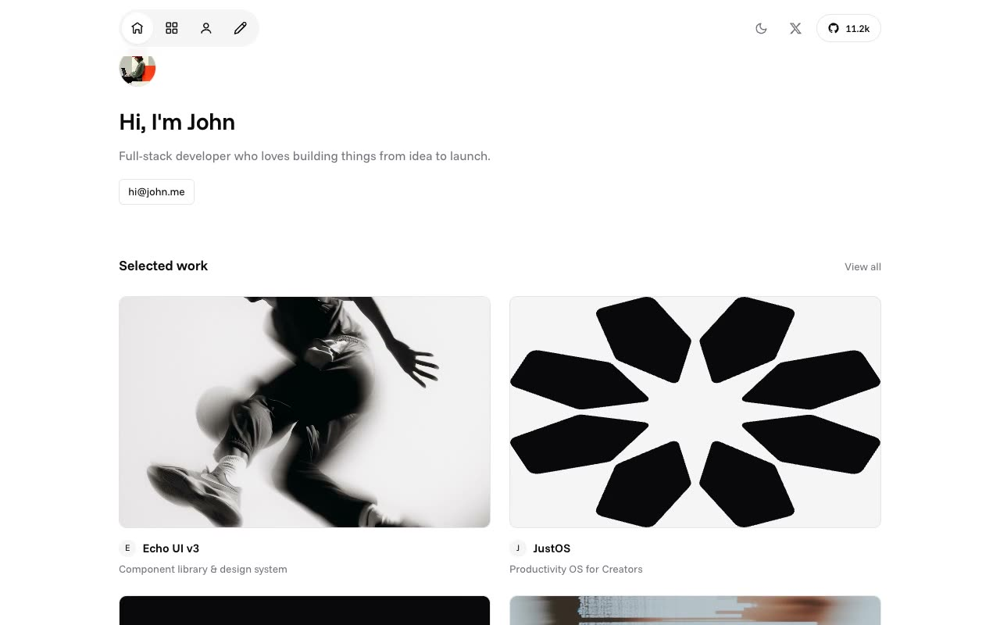

# Echo — Minimal Developer Portfolio Template Clone (Vanilla HTML/CSS/JS)

[](./demo.mp4)

A faithful, self-contained clone of **Echo**, the premium typography-forward developer/maker portfolio template by shadcnblocks.com, rebuilt as plain HTML + CSS + vanilla JavaScript with no build step. It reproduces the full 11-page site — home, projects, about, articles, four project detail pages and three article detail pages — with a monochrome shadcn/ui-style design, a floating icon-pill top nav, a light/dark theme toggle (localStorage persistence, `prefers-color-scheme`, no-flash boot), project filter tabs, card hover states, scroll entrance reveals, a "copy link" clipboard action, and a contribution-graph footer. All assets are vendored locally, including the variable Funnel Sans font, and every color is driven through CSS custom-property tokens. Built as a study/learning clone with vanilla HTML, CSS, and JavaScript. Generated with Claude Fable 5.

## Run

This project has no build step, but it must be served over HTTP (it loads JS, CSS, and font assets via relative paths, so `file://` will not work):

```sh
python3 -m http.server 8000
```

Then open <http://localhost:8000/index.html>.

`prompt.md` holds the full build spec — the design tokens, page-by-page structure, and reproduced interactions — and `demo.mp4` shows the clone in motion.

## Credits

Faithful clone of an existing design, recreated for study/learning. All credit for the original design goes to its creators.

**Original:** Echo — a premium Next.js template by shadcnblocks.com — <https://www.shadcnblocks.com/template/echo>

---

Part of the [Templates](../) collection in the [claude-directory](../../) — an open-source gallery of AI-generated UI built with Claude Fable 5. [Browse the live gallery](https://pulkitxm.com/claude-directory).
