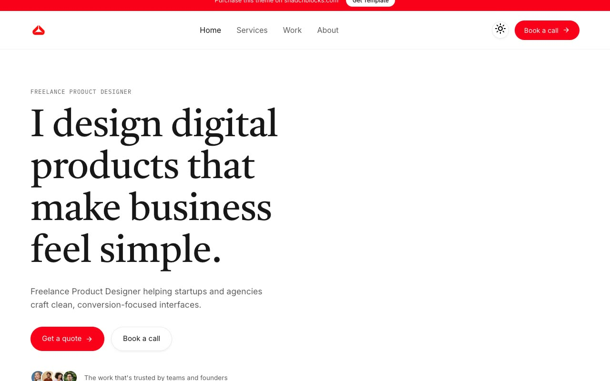

# Hatch — Freelance Product Designer Portfolio Template (Vanilla HTML/CSS/JS, Light + Dark)

[](./demo.mp4)

Hatch is a pixel-faithful, no-build clone of the premium "Hatch" Next.js portfolio/agency template by shadcnblocks, rebuilt as self-contained plain HTML, CSS, and vanilla JavaScript. The editorial design pairs a Castoro serif display headline with Inter body text, IBM Plex Mono labels, and Caveat handwritten accents, a signature red-orange CTA color, and a native light/dark theme toggle persisted to localStorage with a `prefers-color-scheme` default. It spans 18 pages — home, about, services plus four service detail pages, work plus six case-study detail pages, contact, and 404/subscribe/book — with scroll-reveal entrance animations, hover overlays on work cards, and a mobile hamburger menu. Fonts and images are vendored locally under `assets/`. Generated with Claude Fable 5.

## Run

There is no build step. Serve the folder over a static HTTP server:

```sh
python3 -m http.server
```

Then open the printed URL (e.g. `http://localhost:8000/index.html`). Opening `index.html` directly via `file://` works for most pages, but a static server is recommended so the shared scripts and local assets load correctly.

## Project notes

- `index.html` plus the per-page HTML files (`about.html`, `services.html`, `services-*.html`, `work.html`, `work-*.html`, `contact.html`, `subscribe.html`, `book.html`, `404.html`) make up the 18 pages.
- `styles.css` holds the full design system (light/dark CSS variables, spacing, radius, animations).
- `app.js` drives the theme toggle, mobile menu, scroll entrance reveals, and hover interactions.
- `work-data.js` holds the case-study content.
- `prompt.md` is the full build spec; `demo.mp4` shows the template in motion.

## Credits

Faithful clone of an existing design, recreated for study/learning. All credit for the original design goes to its creators.

**Original:** Hatch — a premium Next.js template by shadcnblocks — <https://www.shadcnblocks.com/template/hatch>

---

Part of the [Templates](../) collection in the [claude-directory](../../) — an open-source gallery of AI-generated UI built with Claude Fable 5. [Browse the live gallery](https://pulkitxm.com/claude-directory).
