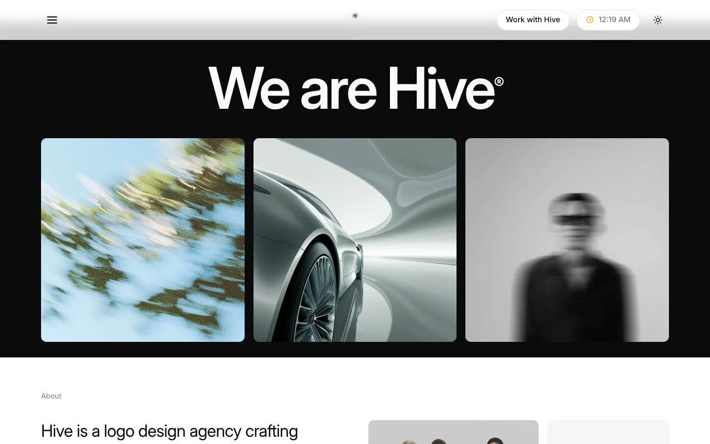

# Hive — Branding-Agency Website Template Clone (Vanilla HTML/CSS/JS, no build)

[](./demo.mp4)

A self-contained, pixel-faithful clone of the Shadcnblocks "Hive" premium branding-agency template — a minimal, monochrome editorial multi-page website with large tight-tracked Inter headings, generous whitespace, and full-bleed abstract imagery. It reproduces all 22 pages, the shared sticky header (hamburger to fullscreen overlay menu, flower logo mark, "Work with Hive" pill, live-clock pill, sun/moon theme toggle) and the shared dark footer, with light and dark themes driven by CSS custom properties and subtle scroll-reveal motion via IntersectionObserver. Built as plain HTML + CSS + vanilla JS with no build step and all assets vendored locally, so it runs fully offline. Generated with Claude Fable 5.

## Run

No build step — serve the folder with any static server and open `index.html`:

```sh
python3 -m http.server
```

Then visit the printed local URL (e.g. `http://localhost:8000`). You can also open `index.html` directly in a browser.

The pages span the home, studio (`about.html`), services (`services.html` plus four service detail pages under `services/`), work (`projects.html` plus twelve project detail pages under `projects/`), contact, and careers — all sharing the same header chrome and dark footer.

The full build specification lives in `prompt.md`, and `demo.mp4` shows the template in motion (light/dark themes, fullscreen menu, and scroll motion).

## Credits

Faithful clone of an existing design, recreated for study/learning. All credit for the original design goes to its creators.

**Original:** Shadcnblocks — Hive template — <https://www.shadcnblocks.com/template/hive>

---

Part of the [Templates](../../../) collection in the [claude-directory](../../../../) — an open-source gallery of AI-generated UI built with Claude Fable 5. [Browse the live gallery](https://pulkitxm.com/claude-directory).
