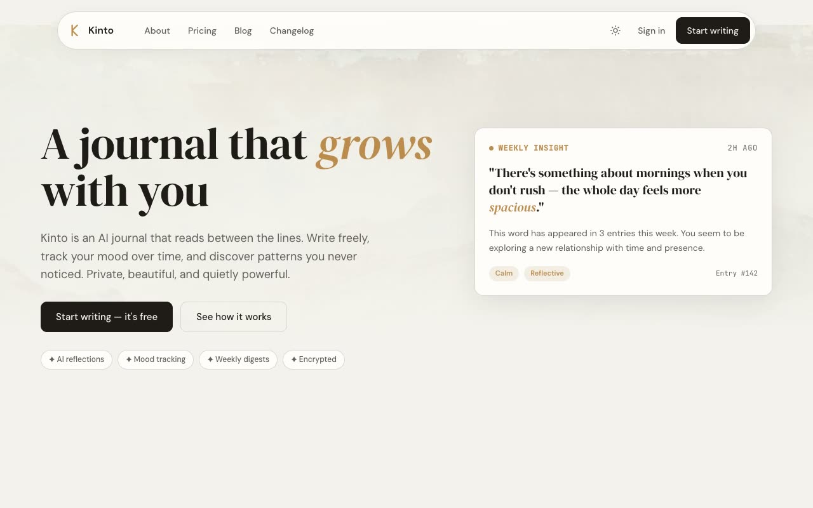

# Kinto — Journaling App Marketing Website Template Clone (HTML + CSS + Vanilla JS)

[](./demo.mp4)

Kinto is a warm, editorial multi-page marketing website for a privacy-first journaling app, recreated as a pixel-faithful, self-contained static site with no build step. It pairs a cream/paper light mode with a near-black dark mode and gold accent, large DM Serif Display headings with italic accent words, DM Sans body, and JetBrains Mono mono labels, plus a persisted light/dark theme toggle (prefers-color-scheme aware), a mobile menu, and IntersectionObserver scroll-reveal animations. Pages include home, about, pricing, a blog index with six posts, changelog, login, signup, and legal privacy/terms — all built with plain HTML, CSS, and vanilla JavaScript with fonts and images vendored locally under `assets/`. Generated with Claude Fable 5.

## Pages

- `index.html` — home (hero, phone mockup, stats, feature/chart grid, testimonials, plan comparison, FAQ, CTA)
- `about.html` — founders story, values, team, FAQ, CTA
- `pricing.html` — two plan cards and a comparison table
- `blog.html` — blog index with featured post and "Load more"
- `blog/*.html` — six article pages
- `changelog.html` — versioned changelog entries
- `login.html` / `signup.html` — split-layout auth forms
- `legal/privacy.html` / `legal/terms.html` — long-form legal documents

## Run

This is a static site with no build step. Serve the project folder and open `index.html`:

```sh
python3 -m http.server
```

Then open the printed local URL (e.g. http://localhost:8000) in your browser.

The theme toggle persists via `localStorage` and honors `prefers-color-scheme` on first load.

`prompt.md` holds the full build spec, and `demo.mp4` shows the site in motion across light and dark mode.

## Credits

Faithful clone of an existing design, recreated for study/learning. All credit for the original design goes to its creators.

**Original:** shadcnblocks — <https://www.shadcnblocks.com/template/kinto>

---

Part of the [Templates](../../../) collection in the [claude-directory](../../../../) — an open-source gallery of AI-generated UI built with Claude Fable 5. [Browse the live gallery](https://pulkitxm.com/claude-directory).
