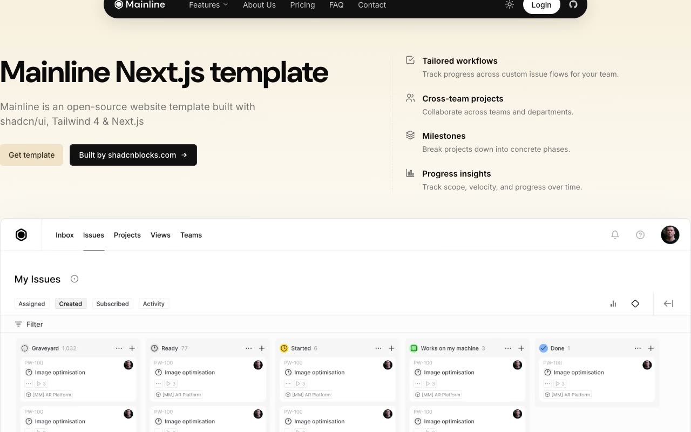

# Mainline — SaaS Product-Management Template Clone (Vanilla HTML/CSS/JS, Light + Dark)

[](./demo.mp4)

Mainline is a faithful, same-to-same clone of the open-source "Mainline" website template by shadcnblocks (originally built with shadcn/ui, Tailwind 4 and Next.js), rebuilt here as a self-contained static site with no build step. It is a clean, modern SaaS / product-management marketing template — neutral OKLCH grayscale palette with a warm gold/tan accent, a floating rounded-pill navbar, a faint "mainline" wordmark watermark, and a full light + dark theme toggle (persisted to `localStorage`, respecting `prefers-color-scheme`). Eight pages (home, about, pricing, FAQ, contact, login, signup, privacy) ship with a Features nav dropdown, FAQ and home accordions, a pricing billing switch, a testimonials carousel, a mobile menu, and scroll reveals. The stack is plain HTML + CSS + vanilla JavaScript, with Inter and DM Sans loaded from Google Fonts. Generated with Claude Fable 5.

## Run

This is a static project with no build step — serve the folder and open `index.html`:

```sh
python3 -m http.server 8000
```

Then visit <http://localhost:8000/index.html>.

The 8 pages are `index.html` (home), `about.html`, `pricing.html`, `faq.html`, `contact.html`, `login.html`, `signup.html`, and `privacy.html`. Shared chrome (navbar, footer CTA, watermark) and all interactions are rendered by `app.js`; styling and the OKLCH light/dark theme tokens live in `styles.css`. The theme is booted before paint by an inline script in each page's `<head>` to avoid a flash, then toggled via the sun/moon button in the navbar.

See `prompt.md` for the full build spec, and `demo.mp4` to watch the template in motion.

## Credits

Faithful clone of an existing design, recreated for study/learning. All credit for the original design goes to its creators.

**Original:** Mainline by shadcnblocks — <https://www.shadcnblocks.com/template/mainline>

---

Part of the [Templates](../../../) collection in the [claude-directory](../../../../) — an open-source gallery of AI-generated UI built with Claude Fable 5. [Browse the live gallery](https://pulkitxm.com/claude-directory).
