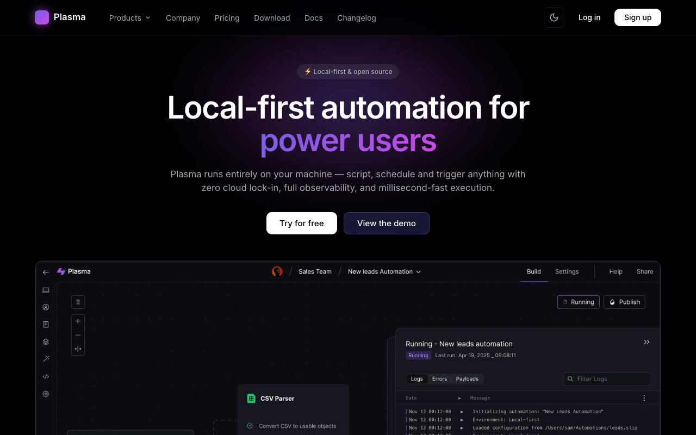

# Plasma — shadcn/ui SaaS Template Clone (Vanilla HTML/CSS/JS, Dark + Light)

[](./demo.mp4)

A self-contained, no-build clone of the **Plasma** shadcn/ui SaaS and developer-tool marketing template, rebuilt as plain HTML, CSS, and vanilla JavaScript. This dark-first template ships 15 pages — home, product, pricing, about, changelog, download, sign in, sign up, and a Fumadocs-style docs hub with six sub-pages — featuring a glowing purple-to-magenta "plasma" gradient, a Radix-style Products dropdown, accordions, tabbed feature showcases, scroll-entrance reveals, and a theme toggle with `localStorage` persistence (dark default + light mode). Everything is driven by shadcn theme tokens carried in both dark and light values, with Inter as the sole typeface. Built with vanilla HTML/CSS/JS (no framework, no build step). Generated with Claude Fable 5.

## Run

This is a static site with no build step. Serve the project folder and open `index.html`:

```sh
python3 -m http.server
```

Then visit `http://localhost:8000/` in your browser. You can also open `index.html` directly, though a local server is recommended so relative asset paths resolve correctly.

Toggle the theme with the header control; the choice persists in `localStorage` and the boot script prevents a flash of the wrong theme on load.

## Pages

15 HTML pages: `index.html` (home), `product.html`, `pricing.html`, `about.html`, `changelog.html`, `download.html`, `signin.html`, `signup.html`, `docs.html`, and the docs sub-pages `docs-installation.html`, `docs-core-concepts.html`, `docs-ai-prompts.html`, `docs-file-systems.html`, `docs-crm-csv.html`, and `docs-cli.html`. Styles and tokens live under `assets/css/` (`tokens.css`, `styles.css`, `auth.css`, `docs.css`); scripts and images live under `assets/js/` and `assets/images/`.

`prompt.md` holds the full build spec (palette, typography, motion, and per-page layout) and `demo.mp4` shows the clone in motion.

## Credits

Faithful clone of an existing design, recreated for study/learning. All credit for the original design goes to its creators.

**Original:** Plasma by shadcnblocks.com — <https://www.shadcnblocks.com/template/plasma>

---

Part of the [Templates](../../../) collection in the [claude-directory](../../../../) — an open-source gallery of AI-generated UI built with Claude Fable 5. [Browse the live gallery](https://pulkitxm.com/claude-directory).
